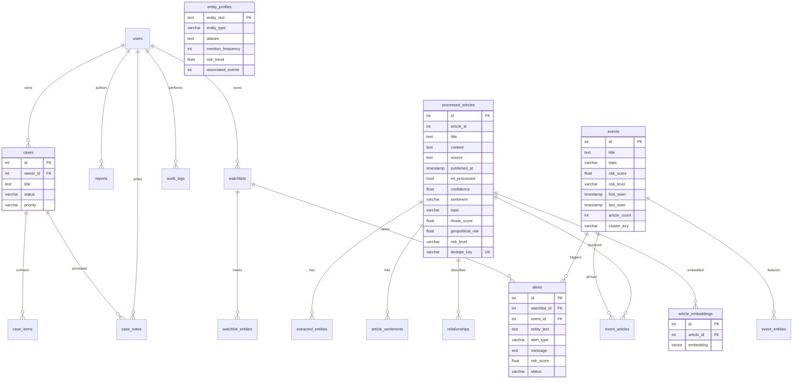
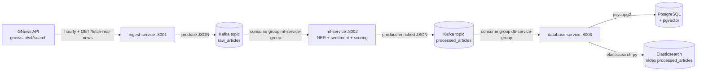
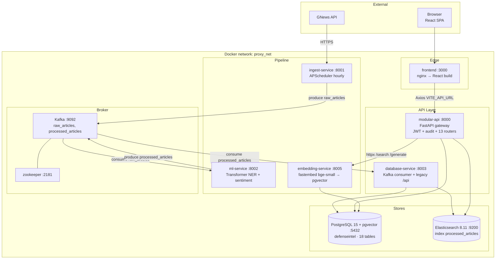
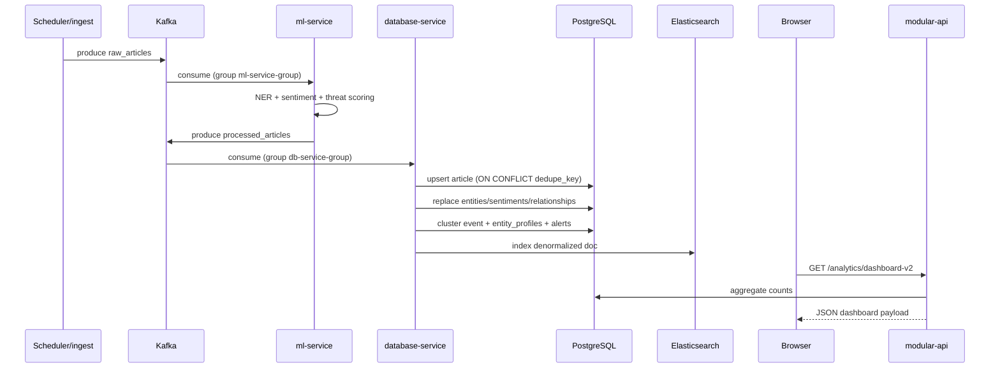

# ProxyDefence — Complete Architecture Report

> Generated 2026-06-19 from static code analysis, `docker-compose.yml`, live PostgreSQL introspection (MCP), OpenAPI spec, and service source. **No files were modified in the production of this report.**

ProxyDefence is an event‑driven, microservices‑based **cyber/geopolitical defense intelligence platform**. News is ingested from the GNews API, enriched by an ML/NLP pipeline, persisted into PostgreSQL (+ pgvector) and Elasticsearch, then served to a React/TypeScript SPA through a modular FastAPI gateway. A graph/event model, watchlists, alerts, cases and report generation are layered on top.

---

## 1. Service Inventory

The stack is orchestrated by `docker-compose.yml` over a single bridge network `proxy_net`. There are **3 infrastructure services**, **6 backend application services**, and **1 frontend service**. Container → host port mappings are shown; internally each Python app listens on `:8000`.

### 1.1 Infrastructure Services

| Service | Image | Host:Container Port | Purpose | Dependencies |
|---|---|---|---|---|
| `zookeeper` | `confluentinc/cp-zookeeper:7.4.0` | (internal `2181`) | Kafka coordination / leader election | — |
| `kafka` | `confluentinc/cp-kafka:7.4.0` | `9092:9092` | Single‑broker Kafka, `auto.create.topics.enable=true` | `zookeeper` |
| `elasticsearch` | `docker.elastic.co/elasticsearch/elasticsearch:8.11.0` | `9200:9200` | Full‑text + fuzzy search index (`processed_articles`); single‑node, security disabled; heap `512m` | volume `elasticsearch_data` |
| `postgres` | `pgvector/pgvector:pg15` | `5432:5432` | Primary OLTP store **with pgvector** extension; DB `defenseintel`, user `admin/admin123`; initialized from `infra/sql/init.sql` | volume `postgres_data` |

### 1.2 Application Microservices (Python 3.11 / FastAPI)

| Service | Source | Host:Container Port | Purpose | Key Deps | Kafka Role |
|---|---|---|---|---|---|
| `ingest-service` | `services/ingest-service/app.py` | `8001:8000` | Pulls conflict news from GNews API (`gnews.io/v4/search`), assigns deterministic SHA‑256‑based `id`, schedules hourly fetch via APScheduler, publishes to Kafka. Endpoints: `/`, `/health`, `/fetch-real-news` | `requests`, `confluent-kafka`, `APScheduler`, GNews API | **Producer** → `raw_articles` |
| `ml-service` | `services/ml-service/app.py` | `8002:8000` | Consumes `raw_articles`; runs NER (Transformer `dbmdz/bert-large-cased` → spaCy `en_core_web_sm` fallback), sentiment (`distilbert-base-uncased-sst-2-english`), topic classification (keyword), threat/risk scoring, relationship inference, keyword extraction, dedupe‑key hashing. Publishes enriched payload. Endpoints: `/`, `/health` | `confluent-kafka`, `spacy`, `transformers`, `torch` (transitive) | **Consumer** `raw_articles` (group `ml-service-group`) **+ Producer** → `processed_articles` |
| `database-service` | `services/database-service/app.py` | `8003:8000` | Consumes `processed_articles`; upserts into Postgres (idempotent on `dedupe_key`), replaces entities/sentiments/relationships, **runs event clustering + entity‑profile + alert generation inline**, and indexes the doc in Elasticsearch. Also exposes its own read APIs (`/api/articles`, `/api/analytics/summary`, `/api/search`, `/api/articles/{id}`, `/rebuild-events`). | `confluent-kafka`, `psycopg2`, `elasticsearch` (sync) | **Consumer** `processed_articles` (group `db-service-group`) |
| `embedding-service` | `services/embedding-service/app.py` | `8005:8000` | Generates & serves vector embeddings using **`fastembed`** model `BAAI/bge-small-en-v1.5`. Creates `article_embeddings(article_id, embedding vector)` table on demand. Endpoints: `/search` (cosine via `<=>`), `/generate` (batch backfill), `/health` | `fastembed`, `asyncpg`, `pgvector` | None (pull model — invoked on demand) |
| `modular-api` | `backend/api_service/main.py` (built via `services/modular-api/Dockerfile`, context `.`) | `8000:8000` | **Primary API gateway for the frontend.** Async FastAPI with pooled `asyncpg` + `AsyncElasticsearch`, lifespan‑managed schema bootstrap, JWT auth, audit middleware, and 13 route modules. Only service with a Docker healthcheck. | `asyncpg`, `AsyncElasticsearch`, `python-jose`, `passlib[bcrypt]`, `httpx`, `email-validator` | None (synchronous read/write gateway) |

### 1.3 Frontend Service

| Service | Source | Host:Container Port | Purpose |
|---|---|---|---|
| `frontend` | `services/frontend/` (multi‑stage: `node:20-alpine` → `nginx:1.27-alpine`) | `3000:80` | React 18 + TS 5.8 + Vite SPA. Axios client (`VITE_API_URL`, default `http://localhost:8000`) → modular-api. Nginx serves built `dist/` with SPA fallback (`try_files … /index.html`). |

**Frontend stack:** Tailwind 3.4, shadcn/ui (Radix), React Router 6, TanStack Query, React Hook Form + Zod, Recharts, Lucide, Cytoscape (graph viz).

### Port Summary (external access)

| 8000 modular-api | 8001 ingest | 8002 ml | 8003 database | 8005 embedding | 3000 frontend | 5432 pg | 9200 es | 9092 kafka |

---

## 2. Database Analysis

Engine: **PostgreSQL 15 + pgvector** (`pgvector/pgvector:pg15`), database `defenseintel`. Verified live via MCP — **15 user tables** exist (init.sql + schema_bootstrap.py + runtime `article_embeddings`).

> ⚠️ **Schema is defined in THREE places** that have drifted: `infra/sql/init.sql` (Docker entrypoint, minimal), `backend/shared/schema_bootstrap.py` (authoritative, run by modular-api on startup), and `services/database-service/app.py::create_tables()` (run by database-service). All three diverge — see §7.

### 2.1 Tables (verified live)

| # | Table | PK | Purpose |
|---|---|---|---|
| 1 | `users` | `id` | Auth users (email/username unique, bcrypt‑hash, role) |
| 2 | `processed_articles` | `id` | Core article store (title, content, source, ml fields, risk/threat, `dedupe_key` unique) |
| 3 | `extracted_entities` | `id` | NER entities per article |
| 4 | `article_sentiments` | `id` | Sentiment rows per article |
| 5 | `relationships` | `id` | Source→target entity relations with evidence + confidence history (JSONB) |
| 6 | `events` | `id` | Clustered incident/event groups (risk_score, risk_level, first/last_seen, cluster_key) |
| 7 | `event_articles` | (`event_id`,`article_id`) | M:N event↔article with similarity_score |
| 8 | `event_entities` | (`event_id`,`entity_text`) | M:N event↔entity with mention_count, avg_confidence |
| 9 | `entity_profiles` | `entity_text` | Aggregate entity profiles (aliases[], mention_frequency, associated_events/relationships[]) |
| 10 | `watchlists` | `id` | Named watchlist owned by a user |
| 11 | `watchlist_entities` | (`watchlist_id`,`entity_text`) | Entities tracked on a watchlist |
| 12 | `alerts` | `id` | Watchlist/event match alerts (status lifecycle, risk_score) |
| 13 | `reports` | `id` | Generated intelligence briefs (JSONB actors/events/recommendations) |
| 14 | `cases` | `id` | Investigation cases (status, priority, owner) |
| 15 | `case_items` | (`case_id`,`item_type`,`item_id`) | Polymorphic case members (alert/event/article/entity) |
| 16 | `case_notes` | `id` | Free‑text notes on a case |
| 17 | `audit_logs` | `id` | Mutation audit trail (JSONB metadata) |
| 18 | `article_embeddings` | `id` | pgvector embeddings (runtime‑created by embedding-service) |

### 2.2 Relationships (FKs, verified live)

```
users (id)
 ├──< cases (owner_id)            ON DELETE SET NULL
 ├──< case_notes (created_by)     ON DELETE SET NULL
 ├──< reports (created_by)        ON DELETE SET NULL
 ├──< watchlists (owner_id)       ON DELETE SET NULL
 └──< audit_logs (user_id)        ON DELETE SET NULL

processed_articles (id)
 ├──< extracted_entities (article_id)     [NO ACTION — schema_bootstrap; init.sql has no ON DELETE]
 ├──< article_sentiments  (article_id)    [NO ACTION]
 ├──< relationships       (article_id)    ON DELETE CASCADE
 ├──< event_articles      (article_id)    ON DELETE CASCADE
 └──< article_embeddings  (article_id)    ON DELETE CASCADE  (runtime)

events (id)
 ├──< event_articles (event_id)   ON DELETE CASCADE
 ├──< event_entities (event_id)   ON DELETE CASCADE
 └──< alerts (event_id)           ON DELETE SET NULL

watchlists (id)
 ├──< watchlist_entities (watchlist_id)  ON DELETE CASCADE
 └──< alerts (watchlist_id)              ON DELETE CASCADE

cases (id)
 ├──< case_items  (case_id)   ON DELETE CASCADE
 └──< case_notes  (case_id)   ON DELETE CASCADE
```

Notable: `case_items` uses a **polymorphic** (`item_type`, `item_id`) pattern — no FK to alerts/events/articles; integrity is enforced only in application code (`allowed_types = {alert, event, article, entity}`).

### 2.3 Indexes (verified live — 44 indexes)

Highlights by table:

- **processed_articles**: unique `idx_processed_articles_dedupe_key(dedupe_key)` (idempotent upsert target), `published_at DESC`, `topic`, `risk_level`. ❗ **No index on `sentiment`** despite being a filter param.
- **events**: `topic`, `risk_score DESC`, `last_seen DESC`.
- **relationships**: `article_id`, `source_entity`, `target_entity`, `relationship_type`.
- **extracted_entities**: `article_id`. ❗ **No index on `entity_text`** — every entity lookup is a full scan (e.g. `GROUP BY entity_text`, `LOWER(entity_text) = …`).
- **alerts**: `status`, composite `(watchlist_id, event_id, LOWER(entity_text))`.
- **event_entities / watchlist_entities**: both have a `LOWER(entity_text)` expression index (good — supports case‑insensitive matching in `generate_alerts`).
- **cases**: `owner_id`, `status`, `updated_at DESC`; `case_items(case_id)`, `case_items(item_type)`; `case_notes(case_id)`, `case_notes(created_by)`.
- **audit_logs**: `created_at DESC`.
- **article_embeddings**: ❗ **No vector (HNSW/IVFFlat) index** — cosine `<=>` ordering does a brute‑force exact scan on every `/search`.

### 2.4 ER Diagram (Mermaid)



---

## 3. Kafka Analysis

Single Confluent broker (`cp-kafka:7.4.0`) + Zookeeper. Topics are **auto‑created** (`KAFKA_AUTO_CREATE_TOPICS_ENABLE: 'true'`). Inter‑broker replication factor = 1 (dev). No schema registry, no Avro/Protobuf — payloads are plain JSON strings.

### 3.1 Topics

| Topic | Producers | Consumers | Payload contract |
|---|---|---|---|
| `raw_articles` | `ingest-service` | `ml-service` (group `ml-service-group`, `earliest`, session 6s) | `{id, title, content, source, published_at, url, image}` (see ingest `news_data`) |
| `processed_articles` | `ml-service` | `database-service` (group `db-service-group`, `earliest`, session 6s) | raw fields **+** `{ml_processed, processed_at, summary, topic, topic_confidence, sentiment, confidence, fake_confidence, threat_score, geopolitical_risk, risk_level, entities[], relationships[], keywords[], content_hash, dedupe_key}` (see `enrich_article`) |

Both consumers use `auto.offset.reset=earliest` and run inside a **daemon thread** spawned in the FastAPI `startup` event (not in a separate worker process).

### 3.2 Producers

- **ingest-service** (`Producer` constructed at module import): `producer.produce('raw_articles', value=json.dumps(news_data))` then `producer.flush()`. No key → round‑robin partitioning (fine for 1 broker).
- **ml-service**: `Producer` created inside `start_kafka_consumer()`. Produces one enriched message per consumed raw message; flushes after each produce (per‑message flush is a throughput bottleneck — see §8).

### 3.3 Consumers

- **ml-service consumer loop**: `consumer.poll(1.0)` → `enrich_article` (heavy: Transformer inference) → `producer.produce('processed_articles')`. Exception in the loop logs and exits the thread (no restart — §7/§8).
- **database-service consumer loop**: `consumer.poll(1.0)` → `process_message` → (1) `upsert_article`, (2) `replace_related_records`, (3) `update_event_intelligence` (the clustering/entity‑profile/alert engine), (4) `index_article` into ES. Each step opens/closes a **fresh psycopg2 connection** (no pooling — §8).

### 3.4 Kafka Data Flow



---

## 4. API Analysis

Two HTTP API surfaces exist. **The frontend talks to `modular-api` (`:8000`)** (per `VITE_API_URL=http://localhost:8000` in compose). The database‑service's `/api/*` endpoints are parallel/legacy.

### 4.1 modular-api (`backend/api_service`) — authoritative surface

FastAPI app `backend.api_service.main:app`, CORS for `localhost:{3000,5173,8081}`, audit middleware writes to `audit_logs` on every POST/PUT/PATCH/DELETE. JWT (HS256, `python-jose`) bearer auth; only `/auth/me` currently enforces it (most routes are unguarded — §7). 13 routers:

| Router (prefix) | Endpoints | Owner module |
|---|---|---|
| **Auth** `/auth` | `POST /register`, `POST /login`, `GET /me` (bearer) | `routes/auth.py` |
| **Articles** `/articles` | `GET /` (limit/offset/sentiment/topic/risk_level filters, dynamic SQL), `GET /{id}`, `GET /{id}/entities` | `routes/articles.py` |
| **Analytics** `/analytics` | `GET /dashboard`, `GET /dashboard-v2`, `GET /summary`, `GET /threat-trends`, `GET /graph`, `GET /timeseries`, `GET /entities`, `GET /topics` | `routes/analytics.py` |
| **Search** `/search` | `GET /?q=` → ES `bool` query (multi_match + match_phrase on title) | `routes/search.py` |
| **Semantic Search** `/semantic-search` | `GET ?q=` → proxies to `embedding-service:8000/search` via httpx | `routes/semantic_search.py` |
| **Graph** `/graph` | `GET /network` (relationships→nodes/edges), `GET /{entity}` (expand_graph repo) | `routes/graph.py` |
| **Events** `/events` | `GET /`, `GET /{id}` (w/ entities+articles), `GET /{id}/articles` | `routes/events.py` |
| **Entities** `/entities` | `GET /` (aggregated), `GET /{name}` (profile), `GET /{name}/articles`, `GET /{name}/relationships` | `routes/entities.py` |
| **Reports** `/reports` | `GET /`, `GET /{id}`, `POST /case/{case_id}` (generate brief from a case) | `routes/reports.py` |
| **Watchlists** `/watchlists` | `GET /`, `GET /{id}`, `POST /`, `DELETE /{id}`, `POST /{id}/entities`, `DELETE /{id}/entities/{entity_text}` | `routes/watchlists.py` |
| **Alerts** `/alerts` | `GET /` (status filter), `GET /{id}`, `PATCH /{id}/status`, `POST /generate` (set‑based watchlist↔event match) | `routes/alerts.py` |
| **Cases** `/cases` | `GET /`, `POST /`, `GET /{id}` (items+notes), `POST /{id}/items`, `DELETE /{id}/items/{type}/{id}`, `GET /{id}/notes`, `POST /{id}/notes` | `routes/cases.py` |
| **Copilot** `/copilot` | `POST /query` (semantic search → entity/relationship/event aggregation → threat assessment) | `routes/copilot.py` |
| **Health** | `GET /health`, `GET /` | `routes/health.py` + main |

Repository layer: `backend/api_service/repositories/intelligence.py` (`IntelligenceRepository`) — single ~1,386‑line class holding all DB logic for events/entities/watchlists/alerts/cases/reports/dashboard/timeline/graph/audit.

#### Request/Response models (Pydantic)

| Model | Fields |
|---|---|
| `RegisterRequest` | `email: EmailStr`, `username` (3–50), `password` (8–128) |
| `LoginRequest` | `email: EmailStr`, `password` (8–128) |
| `WatchlistCreate` | `name` (2–120), `description?`, `entities: list[str]` |
| `WatchlistEntityAdd` | `entity_text` (1–500) |
| `AlertStatusUpdate` | `status: str` (validated against `{open,investigating,escalated,closed}` in repo) |
| `CaseCreate` | `title` (3–200), `description?`, `priority` (validated `{low,medium,high,critical}`) |
| `CaseItemAdd` | `item_type` (validated `{alert,event,article,entity}`), `item_id: int` |
| `CaseNoteAdd` | `note` (3–5000) |
| `CopilotRequest` | `question: str` |
| (DTO stubs in `dto.py`) | `PageParams`, `ReportGenerateRequest`, `WatchlistCreateRequest`, `AlertCreateRequest`, `CopilotQueryRequest` — **defined but largely unused** (routes define their own inline models). |

Successful responses are mostly raw dicts (`record_to_dict` of asyncpg `Record`s). The committed `openapi.json` is regenerated from the live gateway so it tracks the current router set — §7.

### 4.2 database-service API (`:8003`) — parallel/legacy

`GET /`, `GET /health`, `GET /api/articles`, `GET /api/articles/{id}`, `GET /api/analytics/summary`, `GET /api/search`, `POST /rebuild-events` (wipes & re‑clusters all events). The frontend does **not** call these (it uses modular-api), but they remain live.

### 4.3 ingest-service / ml-service / embedding-service HTTP

- ingest: `GET /`, `GET /health` (Kafka probe), `GET /fetch-real-news`.
- ml: `GET /`, `GET /health` (reports model load state).
- embedding: `GET /search?q=`, `GET /generate`, `GET /health`.

---

## 5. System Data Flow

### 5.1 Article Ingestion
1. APScheduler in `ingest-service` fires `fetch_real_news()` on startup and every **1 hour** (also on‑demand via `GET /fetch-real-news`).
2. GNews API queried: `q="world news" OR "conflict" OR "war"`, `lang=en`, `max=10`, `from = now-3d`.
3. Each article: skip if no `url`; deterministic `id = int(sha256(url)) % 10**8`; build `{id,title,content||description,source.name,publishedAt,url,image}`; `producer.produce('raw_articles')`; `producer.flush()`.

### 5.2 ML Processing (`enrich_article`)
For each consumed raw article:
1. `build_full_text` (title + content).
2. `summarize_text` (first 2 sentences > 30 chars, capped 360 chars).
3. `analyze_sentiment` — DistilBERT SST‑2 (truncates to 1000 chars); falls back to `("neutral", 0.4)` if model missing.
4. `classify_topic` — keyword counts over `war/diplomacy/economics/cyber`; confidence = best/total.
5. `extract_entities` — BERT NER (`dbmdz/bert-large-cased`, threshold 0.70, types LOC/ORG/PER/MISC, top 12) → spaCy fallback (PERSON/ORG/GPE, score 0.90). Applies `ENTITY_ALIASES` (us→United States, etc.) and `IGNORE_ENTITIES` blocklist.
6. `score_threat` — weighted sum: keyword tiers (critical 35 / high 20 / medium 10) + sentiment (neg 25) + topic (war 20, cyber 18…) + `min(entities*2, 15)`, capped at 100; `geopolitical_risk = threat*0.92 + keyword*0.4`; `risk_level` buckets at 75/55/30.
7. `infer_relationships` — combinations of top‑5 actor entities, relationship type from `RELATIONSHIP_KEYWORDS` (attack/alliance/sanction/diplomacy/association), confidence 0.80 (typed) or 0.55.
8. `extract_keywords` — regex tokens (len≥4) minus stopwords, top 8 by Counter.
9. Hashes: `content_hash = sha256(full_text)`, `dedupe_key = sha256(url|source|full_text[:500])`.
10. Published as one JSON to `processed_articles`.

### 5.3 Persistence (database-service `process_message`)
1. `upsert_article` — `INSERT … ON CONFLICT(dedupe_key) DO UPDATE … RETURNING id` (idempotent reprocessing).
2. `replace_related_records` — deletes+reinserts entities/sentiments/relationships for the article; writes `confidence_history` JSONB and `source_article_ids[]`.
3. `update_event_intelligence` — **the clustering engine**:
   - Normalize/blacklist entities (Reuters/AP/CNN/BBC…, aliases like trump→donald trump).
   - Score candidate events (last 72h OR same topic) by **0.60 entity Jaccard + 0.15 topic + 0.15 time‑proximity + 0.10 token similarity**; require ≥2 shared entities and score ≥0.60 → assign, else create new event.
   - Upsert `event_articles`, `event_entities` (mention_count++, avg_confidence rolling avg).
   - Recompute event aggregates (`article_count`, `AVG(threat_score)`→risk_score, risk_level, first/last_seen).
   - Upsert `entity_profiles` (mention_frequency++, associated_events/relationships arrays).
   - **Auto‑generate `alerts`** when an entity on a watchlist has `threat_score ≥ 55` (type `risk_change`).
4. `index_article` — writes a denormalized doc (incl. `entities: [text…]`) into ES index `processed_articles`, `_id = dedupe_key or id`.

### 5.4 Embedding Generation (on demand, `embedding-service`)
- `GET /generate` selects `processed_articles` lacking a row in `article_embeddings`, embeds `"{title} {summary}"` with **BAAI/bge-small-en-v1.5** (384‑dim via `fastembed`), inserts `embedding vector`.
- Not wired into the Kafka pipeline — must be triggered manually or scheduled externally (§7).

### 5.5 Search Workflow
- **Lexical**: `GET /search?q=` (modular-api) → ES `bool` (multi_match on `title^3, summary^2, content, source, topic` + match_phrase title boost 4, fuzziness AUTO), sorted by `_score` then `published_at`.
- **Semantic**: `GET /semantic-search?q=` (modular-api) → httpx → `embedding-service:8000/search` → embed query → pgvector cosine `1 - (embedding <=> q)` → top 5 joined to `processed_articles`. **Exact NN scan** (no ANN index) — §8.

### 5.6 Copilot Workflow (`POST /copilot/query`)
1. Embedding/semantic search via `embedding-service` → top articles + `article_ids`.
2. Postgres aggregation over those ids: top entities (PERSON/ORG/GPE), top relationships, related events (via `event_articles`).
3. Threat level from count of high/critical articles (≥4 critical, ≥2 high, ≥1 medium, else low).
4. Entity normalization (aliases + blacklist), `entity_profiles` lookup for top 5.
5. Threat‑indicator counts (military/economic/diplomatic by topic).
6. Composes a text `summary` + structured JSON. **Note:** Copilot is a deterministic aggregator — no LLM call despite the name.

---

## 6. Architecture Diagram (Mermaid)



### Request/Event Sequence (ingest → dashboard)



---

## 7. Technical Debt Report

### Critical / Correctness

1. **Triplicated, drifted schema definitions.** `infra/sql/init.sql` (3 tables + relationships), `backend/shared/schema_bootstrap.py` (18 statements, authoritative), and `services/database-service/app.py::create_tables()` (similar but separately maintained) all define the schema. `article_embeddings` exists **only** at runtime (embedding-service). High risk of drift; e.g. `extracted_entities.article_id` ON DELETE behaviour differs across sources. **Recommendation:** single source of truth (Alembic migrations) consumed by all services.
2. **`openapi.json` is regenerated from the live gateway.** The committed spec now includes alerts, watchlists, cases, reports, copilot, entities, semantic-search, search `/`, analytics `/dashboard*` `/threat-trends` `/timeseries` `/topics` `/entities` `/graph`, so generated clients can stay in sync with the API surface.
3. **Auth is largely unenforced.** Only `/auth/me` uses `get_current_user`. Every analytics/articles/events/cases/watchlists/alerts/reports/graph/copilot route is anonymous. The audit middleware records `user_id=None` for all mutations. JWT infrastructure exists but isn't applied.
4. **Secrets committed to the repo / compose.** GNews `NEWS_API_KEY` is hard‑coded in `docker-compose.yml` and as a default in `ingest-service/app.py`. Postgres creds `admin/admin123` and `JWT_SECRET_KEY="proxydefence-dev-secret"` are defaults. ES runs with `xpack.security.enabled=false`.
5. **Dead/parallel services still in the stack.** `database-service`'s HTTP API duplicates modular-api's surface. The git status shows `backend/api_service/routes/{alerts,copilot,entities,events,reports,timeline,watchlists}.py` were recently deleted then re‑added — ownership boundary is unstable.

### Reliability

6. **Consumer threads die silently.** Both Kafka consumers run in `threading.Thread(daemon=True)` started in `@app.on_event("startup")`. An unhandled exception logs and exits the thread; the FastAPI process stays "healthy" (HTTP `/health` green) while the pipeline is dead. No supervisor, no restart, no lag/health probe for the consumer.
7. **No connection pooling in database-service.** `get_postgres_connection()` opens a brand‑new `psycopg2` connection (with retry loop) for *every* SQL operation inside `process_message` (upsert, replace‑related, each event‑intelligence sub‑query, indexing). Per‑message connection churn will dominate latency under load.
8. **`article_embeddings` has no FK enforcement guaranteed at boot.** Created lazily by embedding-service; if that service hasn't run, semantic search/copilot return empty.
9. **Rebuild‑events is destructive and unguarded.** `POST /rebuild-events` `DELETE`s all `event_entities`, `event_articles`, `events` then re‑clusters sequentially — no transaction, no auth, no lock. A mid‑run crash leaves partial state.
10. **No migrations / no down‑path.** Schema changes are additive `ADD COLUMN IF NOT EXISTS`; renamed/dropped columns can't be rolled out safely.

### Code Quality

11. **`IntelligenceRepository` is a 1,386‑line god class.** Mixes events, entities, watchlists, alerts, cases, reports, dashboard, timeline, graph, audit, and report‑text generation (`_build_*`). Should be split per aggregate.
12. **`routes/copilot.py`** is a ~390‑line route with inline SQL, `print()` debugging, duplicated alias/blacklist maps (also redefined in `graph.py`, `database-service`, and `ml-service`). Print statements ship to production stdout.
13. **Inconsistent entity alias/blacklist maps** duplicated in 4 places (`ml-service`, `database-service`, `routes/copilot.py`, `routes/graph.py`) with divergent contents.
14. **DTO module (`dto.py`) mostly dead.** Routes redeclare their own Pydantic models inline.
15. **Empty placeholder packages** shipped: `services/kafka-consumers/`, `infra/kafka/`, `infra/elasticsearch/`, `lib/*.py`, `example-consumer/app.py` are all 0‑byte. CLAUDE.md references a non‑existent root `frontend/` dir (real one is `services/frontend/`).
16. **Deprecated FastAPI lifecycle.** `@app.on_event("startup"/"shutdown")` used in 4 services; modular-api correctly uses `lifespan`. Mixed patterns.
17. **Mixed sync/async DB drivers.** database-service uses sync `psycopg2` inside an async event loop's thread; modular-api uses `asyncpg`. Two drivers, two pooling stories, two schema bootstraps against the same DB.
18. **Analytics graph endpoint ships fake data** (`routes/analytics.py::get_attack_graph`) — returns a hardcoded Iran/Israel/Saudi/USA graph when the query is empty.
19. **No tests** anywhere in the repo (no `tests/`, no pytest config).
20. **`python-jose`** is used for JWT — JOSE is in maintenance/deprecation discussions; `pyjwt`/`authlib` is the modern choice.

---

## 8. Scalability Bottlenecks

Ranked by expected impact under ingest/query load:

1. **`update_event_intelligence` is O(articles × recent_events) per message, single‑threaded.** For each incoming article it scans up to 25 candidate events, computes Jaccard + token + time scores in Python/SQL, then runs ~5 more queries per entity (events/relationships/profiles/alerts). This is the **primary write‑path bottleneck** — throughput is bounded by a single consumer thread doing N+1 queries with per‑query new connections.
2. **No connection pool in database-service** (see §7.7). Connection setup cost × (5–20) queries × every message. Fix: pool, or move persistence into the async modular-api/shared pool.
3. **pgvector exact NN scan.** `article_embeddings` has no HNSW/IVFFlat index; every `/semantic-search` and `/copilot/query` does a brute‑force cosine sort over the whole table. Degrades linearly with article count. Fix: `CREATE INDEX … USING hnsw (embedding vector_cosine_ops)`.
4. **ml-service per‑message `producer.flush()`.** Forces a round‑trip to the broker after every enriched article, serializing the pipeline. Batch or flush periodically.
5. **Single Kafka broker, RF=1, `session.timeout.ms=6000`.** No partition parallelism (1 partition effectively ⇒ no consumer scale‑out), no durability, tight session timeout risks rebalance storms during Transformer model load (which can stall poll loops > 6 s).
6. **Heavy model load in ml-service on the request thread group.** DistilBERT + BERT‑large NER run synchronously per message; throughput ≈ 1/GPU/CPU‑inference time. No batching, no GPU config, no model server (Triton/TEI). The `health` endpoint reports model status but there's no readiness gate before Kafka subscription.
7. **Missing indexes on hot filter/join columns:** `processed_articles.sentiment` (filtered in `/articles`), `extracted_entities.entity_text` (aggregated in `/entities`, `/analytics/entities`, copilot, entity profile fallback). Will table‑scan as data grows.
8. **`/graph/network` and `/analytics/graph`** pull up to 250 / 100 rows and build the graph in Python; no pagination/caching. Cytoscape render in the browser will also struggle as node count grows.
9. **Single PostgreSQL instance** with no read replica; every analytical query (dashboard‑v2 issues ~13 sequential `fetchval` calls) competes with the write consumer on the same DB. A read replica + splitting OLAP from the ingest path is the next step.
10. **Elasticsearch single‑node, 512 MB heap, no replica shards.** Fine for dev; at scale needs clustering, and the `processed_articles` index mapping is implicit (auto‑mapped, no analyzers tuned for the multi_match field weights).
11. **`/copilot/query` blocks on a synchronous httpx round‑trip to embedding-service then runs several serial SQL queries** (one per top entity). Under concurrent users this saturates the pool (`max_size=10` in `db_pool.py`).
12. **Frontend served as static nginx with no CDN/HTTP caching headers** beyond nginx defaults; TanStack Query provides client caching but there's no server‑side caching layer (the `services/cache.py` stub exists but is unused).

---

### Appendix — Verification Provenance

- **Service inventory / ports / deps:** `docker-compose.yml`, `services/*/Dockerfile`, `services/*/requirements.txt`.
- **Schema (18 tables, 17 FKs, 44 indexes):** live `information_schema` via `mcp__postgres__query` (matches `schema_bootstrap.py`).
- **Kafka topics/groups:** `services/ingest-service/app.py:80,413`, `services/ml-service/app.py:413,434`, `services/database-service/app.py:807`.
- **API surface:** `backend/api_service/main.py` + `backend/api_service/routes/*.py`; regenerated `openapi.json` cross‑checked.
- **Frontend wiring:** `services/frontend/src/lib/api.ts`, `App.tsx`, `Dockerfile`, `nginx.conf`.

*No source, schema, or configuration files were modified during this analysis.*
