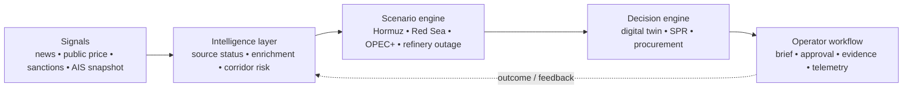

# ProxyDefence Hackathon Winning Playbook

## Purpose

This is the final presentation, demo, video, and judge-Q&A playbook for the
**AI-Driven Energy Supply Chain Resilience for Import-Dependent Economies**
challenge. It is tailored to the working ProxyDefence prototype.

The winning story is not “we built many AI features.” It is:

> **When Hormuz is disrupted, an Indian refinery team needs a defensible
> decision in minutes, not a news summary. ProxyDefence converts a disruption
> signal into a refinery-specific supply-gap assessment, SPR option,
> procurement shortlist, and auditable approval brief.**

Do not claim real-time AIS coverage, predictive accuracy, a customer’s cargo
compatibility, monetary savings, or autonomous trade execution unless you can
show the evidence during judging. The prototype wins by being more executable,
transparent, and honest than a generic dashboard.

---

## 1. The one-line pitch

**ProxyDefence is an AI decision cockpit that turns a geopolitical supply shock
into a refinery-specific, evidence-backed crude rerouting and SPR response.**

Alternative, more dramatic version:

**A Hormuz alert should not trigger a war room and spreadsheets; it should
trigger an evidence-backed decision brief.**

---

## 2. Your winning angle

The hackathon brief permits several ideas: risk intelligence, scenario
simulation, procurement rerouting, SPR optimisation, and a digital twin.
ProxyDefence connects all five in one visible operating loop:

```text
Monitor → Assess → Decide → Approve → Learn

Signal / source status
  → corridor risk and scenario selection
  → digital-twin supply-gap simulation
  → India-only SPR option + procurement alternatives
  → evidence bundle + approval + telemetry
```

Most teams will likely stop at one of these:

- a news/RAG chatbot;
- a beautiful risk map with no decision;
- a scenario simulator with no procurement action;
- a procurement list with no scenario or evidence;
- or an LLM that sounds decisive but cannot show its inputs.

Your differentiation is the **closed decision loop**. The output is not “risk
is high”; it is “for this refinery and this scenario, here is the estimated
gap, the reserve option, the ranked alternatives, the caveats, and the
approval record.”

---

## 3. Background slide: what to say and what not to say

### Spoken script — 45 seconds

> India’s crude supply is structurally exposed to imported oil and vulnerable
> shipping corridors. A disruption at Hormuz or the Red Sea does not create a
> simple news problem. It creates a decision problem: Which refinery is
> exposed? How large could the supply gap become? Should reserves be used? What
> alternative crude or route is feasible? Who approved the response? Today,
> those answers are fragmented across alerts, spreadsheets, maps, and calls.
> ProxyDefence is the intelligence and decision layer that brings them into one
> auditable workflow.

### Suggested slide copy

**India’s energy-security problem is operational, not informational.**

- Import dependency makes corridor disruptions economically material.
- A disruption forces refinery, logistics, procurement, and policy decisions
  at the same time.
- Traditional planning is periodic; the response window is hours.
- The gap is an intelligence-to-action workflow with assumptions and evidence.

### Source discipline

Use the organiser’s supplied figures only as “challenge context,” and show a
small source footer. For public demo evidence, the repository already records
official/public references for Indian refinery capacity and strategic storage
in [Public Demo Profile](10_PUBLIC_DEMO_PROFILE.md).

Do **not** use the “47 days longer to stabilise” statement as your headline
unless you have the original McKinsey source and can explain its methodology.
It is not necessary to win the argument.

---

## 4. Solution architecture slide

### Diagram to use



### Spoken script — 50 seconds

> The architecture is designed around a decision, not around a model. Public
> intelligence inputs are ingested and explicitly labelled by source, observed
> time, ingestion time, freshness, and mode. The risk layer detects and
> explains corridor pressure. The scenario engine converts that pressure into
> a testable disruption assumption. The digital twin, SPR optimiser, and
> procurement orchestrator then produce a single decision brief. Finally, the
> system persists the evidence, approval state, and time taken. That means a
> judge can ask “why did you recommend this?” and we can show the answer.

### Technical architecture facts to mention only if asked

- FastAPI microservices, React command center, PostgreSQL, Kafka, and
  Elasticsearch.
- ML enrichment plus trained risk-serving components, with deterministic
  constraint logic for decision-critical calculations.
- PostgreSQL is the auditable source of truth; Elasticsearch supports search;
  Kafka carries article events.
- The energy service owns scenario, twin, SPR, procurement, evidence, and
  replay records.

For a full technical explanation, see [Codebase Guide](11_CODEBASE_GUIDE.md).

---

## 5. Core workflow slide

### Slide title

**From disruption signal to approved action in one operating loop**

### Slide copy

| Step | What ProxyDefence does | What the operator gets |
| --- | --- | --- |
| 1. Monitor | Ingests/uses geopolitical and logistics signals | Source status and disruption signal |
| 2. Assess | Selects a transparent scenario and runs the twin | Exposure, supply gap, run-rate/economic assumptions |
| 3. Decide | Optimises SPR and ranks alternatives | Cost/risk/lead-time/compatibility trade-off |
| 4. Approve | Records human review and caveats | Persistent evidence bundle |
| 5. Learn | Stores telemetry and replays | Measurable response time and post-event review |

### Spoken script — 40 seconds

> This is what makes the product usable. Monitoring alone makes people more
> anxious. Our workflow converts a signal into a decision. The operator can
> target a refinery, inspect the scenario and assumptions, compare the supply
> gap against reserve coverage and alternatives, then mark the response as
> reviewed. The product does not execute a trade or reserve release; it gives
> the right people a defensible brief quickly.

---

## 6. Live-demo plan — the most important section

### Demo objective

Show one complete “Hormuz disruption → refinery-specific decision” path in
under three minutes. Do not attempt to demonstrate every screen.

### Before judges enter

1. Restart the application stack so the current code is loaded.
2. Run the deterministic readiness check:

   ```powershell
   scripts/demo/start-pilot.ps1
   scripts/demo/verify-pilot-readiness.ps1
   ```

3. Open the Command Center in the browser:

   ```text
   http://127.0.0.1:8080/command
   ```

4. Log in before presenting.
5. Keep one terminal open with the final verifier output as backup evidence.
6. Keep [Pilot Demo Runbook](08_PILOT_DEMO_RUNBOOK.md) open on a hidden tab.

### Exact live script — 2 minutes 45 seconds

**0:00–0:15 — set the situation**

> Assume we receive a critical report of a Strait of Hormuz shipping
> disruption. I am a refinery supply planner. I do not want a news summary; I
> need a decision for my refinery.

**0:15–0:35 — show source truth**

Point to the source/freshness labels.

> Before using any number, the system tells me whether it is live, cached,
> replayed, fallback, or disabled. That prevents a dangerous demo pattern:
> presenting a seed or snapshot as live intelligence.

**0:35–0:55 — choose the refinery**

Select **Jamnagar Refinery** in the Command Center.

> I select the affected refinery. The prototype uses catalog-level capacity,
> Nelson complexity, and accepted crude labels. It clearly states that this is
> screening logic, not a verified cargo assay.

**0:55–1:10 — trigger response**

Click **Respond to top threat**.

> With one action, the response orchestrator selects the relevant scenario,
> runs the digital twin, evaluates Indian SPR coverage, and ranks procurement
> options against the modelled gap.

**1:10–1:45 — show the decision, not every metric**

Point to: selected scenario, estimated gap, SPR recommendation, number of
procurement alternatives, and recommendation summary.

> The scenario is explicit, so the output can be challenged. The twin gives a
> modelled gap. The SPR engine produces a policy-support option, and the
> procurement engine ranks alternatives by the stated cost, risk, lead-time,
> route, and grade-screening constraints. Alternatives are not double-counted
> as committed cargo volume.

**1:45–2:15 — show evidence and approval**

Open evidence/provenance and click **Mark reviewed**.

> This is the operational difference. Every result has a persistent evidence
> bundle: source modes, assumptions, scenario, outputs, caveats, approval
> state, and telemetry. The human still owns the decision.

**2:15–2:35 — show latency and replay**

> The latency is measured, not scripted. We also support reproducible replays
> for Abqaiq 2019, Russia sanctions 2022, and Red Sea 2024, allowing us to
> evaluate decision behaviour without pretending to have perfect forward
> prediction.

**2:35–2:45 — close**

> ProxyDefence turns a geopolitical shock into an explainable, refinery-aware
> decision packet. That is how an import-dependent economy moves from reactive
> crisis response to managed resilience.

### Never do this in the demo

- Do not say “this is live AIS” when the UI says cached snapshot.
- Do not say “AI predicts war” or claim a forecast accuracy you cannot show.
- Do not let a generic Copilot/RAG screen become the main demo.
- Do not scroll through dozens of tables.
- Do not say a procurement option is automatically executable; state the
  cargo-assay, contract, berth, sanctions, and human approval caveats.
- Do not hard-code a response-time claim. Point to the current telemetry.

### Demo fallback plan

| Failure | What to do |
| --- | --- |
| Live news/connector unavailable | Run the built-in historical replay and say why replay is more reproducible for judging. |
| External AI response slow | Stay on the deterministic response orchestration path; it does not depend on a chatbot answer. |
| Browser/UI problem | Show verifier output, use the API evidence bundle, then return to a pre-recorded backup video. |
| Internet unavailable | Use local seeded/replay data, visibly marked as replay/fallback. |
| Judge challenges an input | Open provenance and explain its source mode, freshness, fallback reason, and limitation. |

---

## 7. Slide-by-slide presentation script

Use 8 slides in approximately 6–7 minutes, then demo for 3 minutes.

### Slide 1 — Title / hook (20 seconds)

**Title:** ProxyDefence: From Hormuz Alert to Refinery Decision

> A corridor disruption should not send refinery teams into a spreadsheet war
> room. ProxyDefence gives them an evidence-backed response path.

### Slide 2 — Problem (45 seconds)

Use Section 3 background script.

**Visual:** India import/corridor exposure illustration; do not overcrowd with
statistics.

### Slide 3 — Why existing tools fail (35 seconds)

**Title:** Existing tools observe risk. Operators still have to make the decision.

| Traditional view | ProxyDefence response |
| --- | --- |
| Weekly planning and static dashboards | Signal-triggered scenario response |
| News or map only | Source-aware corridor/risk assessment |
| Spreadsheet alternatives | Constrained, ranked decision options |
| Informal calls/approvals | Evidence bundle and approval lifecycle |

> The key gap is orchestration: connecting signal, impact, alternative, and
> accountable action.

### Slide 4 — Solution (35 seconds)

Show the Monitor → Assess → Decide → Approve → Learn loop.

> We are not building another alerting dashboard. We are building the response
> layer between intelligence and procurement/policy action.

### Slide 5 — Architecture / technical excellence (55 seconds)

Show the simplified architecture diagram.

> The critical design decision is that evidence and deterministic constraints
> sit alongside AI. An LLM can help understand unstructured intelligence, but
> it does not get to invent supply gaps or approve cargoes.

### Slide 6 — Live demo (3 minutes)

Run the exact script in Section 6.

### Slide 7 — Why it scores (45 seconds)

**Title:** Built for judgeable resilience, not just a polished concept

- **Innovation:** Closed loop from risk signal to decision evidence.
- **Business impact:** Faster, more traceable refinery response preparation.
- **Technical excellence:** Event pipeline, ML/rules separation, scenario/twin,
  SPR, procurement, auditability.
- **Scalability:** Connector/source contract, modular services, reusable
  scenario/replay framework.
- **UX:** A single decision flow, source truth, approval state, not a maze of
  dashboards.

### Slide 8 — Pilot / closing (30 seconds)

**Title:** The next step: one refinery, one workflow, measurable value

> Our next step is a six-week design-partner pilot: configure approved refinery
> constraints, run a tabletop Hormuz or Red Sea scenario, measure
> signal-to-brief time and evidence completeness, and then decide whether to
> integrate internal data. We are ready to turn a public-data prototype into a
> real resilience operating system.

---

## 8. How this maps to judging criteria

| Criterion | Weight | What judges should see | Exact proof in ProxyDefence |
| --- | ---: | --- | --- |
| Innovation | 25% | More than a dashboard or chatbot | Signal → scenario → twin → SPR → procurement → evidence in one loop |
| Business impact | 25% | A buyer and an urgent decision | Refinery procurement/supply-planning workflow; explicit pilot plan |
| Technical excellence | 20% | Working architecture and testable assumptions | Services, risk/twin/SPR/procurement engines, evidence, replays, tests |
| Scalability | 15% | Clear data/service boundaries | Kafka pipeline, source contract, PostgreSQL records, connector-ready design |
| User experience | 15% | A user can act quickly and trust the output | Command Center, refinery targeting, provenance, approval lifecycle |

### A scoring line to say verbatim

> We designed every feature around the judging question: Can a judge see the
> signal, inspect the assumptions, understand the impact, act on the
> recommendation, and verify how long it took? In ProxyDefence, the answer is
> yes.

---

## 9. High-pressure judge questions and answers

### “Is this actually real time?”

> The system is source-status aware. We distinguish live, cached, replayed,
> fallback, and disabled inputs on every decision. The public demo does not
> claim continuous AIS or customer data it does not have. The architecture is
> ready for licensed continuous connectors; the prototype proves the decision
> workflow and exposes current data quality honestly.

### “How accurate is your disruption probability?”

> We separate offline model quality from operational decision quality. The
> prototype has trained components and historical replays, but we do not claim
> forward-looking geopolitical accuracy without a time-split evaluation and
> customer outcome data. Every risk output exposes its drivers and assumptions
> so operators can challenge it.

### “Why should a refinery trust an AI recommendation?”

> It should not trust a black box. That is why the output is a decision brief,
> not an autonomous trade. The refinery sees source mode, scenario assumptions,
> constraints, caveats, alternatives, and approval state. The human remains
> accountable.

### “Can you execute the procurement order?”

> Not by design. We provide decision support. Execution requires customer
> contracts, cargo assays, berth windows, sanctions/compliance review, and
> explicit human authorisation. Our next integration point is the customer’s
> approved workflow, not an unsafe automation shortcut.

### “What makes this better than ChatGPT plus a map?”

> A chat answer cannot reliably store source freshness, model a constrained
> supply gap, enforce compatibility screening, prevent option-volume double
> counting, persist an evidence record, or run a reproducible approval and
> replay workflow. ProxyDefence uses AI where unstructured intelligence helps,
> and deterministic models where accountability matters.

### “How does the digital twin work?”

> It is a network-flow, scenario-driven twin. A disruption changes corridor or
> supplier availability; the engine propagates that through infrastructure and
> demand assumptions to estimate the supply gap and downstream impact. It is a
> calibrated prototype today and becomes a customer-grade twin with approved
> refinery and logistics data.

### “What data do you need from a customer?”

> Minimum viable data is refinery configuration, accepted crude/assay rules,
> demand/run-rate curves, inventory and reserve policy, supplier/contract
> constraints, route/port preferences, and approval roles. We start public-data
> first, then request only approved data necessary for each pilot outcome.

### “How do you scale across countries?”

> Keep the decision primitives constant—signals, corridors, scenarios,
> constraints, evidence, approvals—and localise the asset catalog, policies,
> supplier relationships, market data, and regulatory conditions. India is the
> narrow wedge; the architecture is reusable for other import-dependent
> economies.

### “What is the biggest limitation today?”

> The public prototype does not contain a refinery’s private contract,
> inventory, cargo-assay, berth, or approval data. So it is a credible decision
> workflow and public-data demonstration, not a production procurement system.
> That is exactly what a design-partner pilot is intended to validate.

---

## 10. Demo-video script — 2 minutes 30 seconds

Use screen recording plus voice-over. Do not use background music louder than
your voice.

**0:00–0:15:**

> India’s oil-supply exposure turns a geopolitical alert into a refinery
> decision problem. ProxyDefence is the response layer.

**0:15–0:35:** Show architecture / source labels.

> We ingest intelligence inputs and make their freshness and mode visible. No
> cached snapshot is presented as live intelligence.

**0:35–1:00:** Show Command Center and select Jamnagar.

> A planner targets a refinery and launches a response to a critical Hormuz
> disruption signal.

**1:00–1:35:** Click response and show scenario/twin/SPR/procurement result.

> ProxyDefence selects an explicit scenario, estimates the supply impact,
> evaluates reserve support, and ranks alternatives against risk, lead time,
> route, and grade-screening constraints.

**1:35–2:05:** Show evidence and review action.

> The result is saved as an evidence bundle with assumptions, provenance,
> caveats, approval history, and timing. AI accelerates the analysis; people
> retain control of the decision.

**2:05–2:30:** Show replay list or final card.

> Historical replays make the workflow reproducible. ProxyDefence turns a
> crisis alert into a managed, auditable response—before a supply shock becomes
> a supply crisis.

---

## 11. Submission package checklist

### Working prototype

- [ ] `scripts/demo/verify-pilot-readiness.ps1` passes immediately before
  recording.
- [ ] Command Center opens at `/command`.
- [ ] One replay and one refinery-targeted response are pre-checked.
- [ ] Source labels are visible.
- [ ] Evidence/approval and telemetry are visible.

### Architecture diagram

- [ ] Use the simple five-block decision-loop architecture first.
- [ ] Keep a detailed service diagram in appendix/backup.
- [ ] Label what is live, cached, replay, fallback, and customer-only.

### Deck

- [ ] Eight slides maximum before Q&A.
- [ ] One message per slide.
- [ ] Large type and fewer than 35 words of text on most slides.
- [ ] Show the workflow and evidence, not only technology logos.
- [ ] Add source footnotes for factual country/refinery/reserve claims.

### Video

- [ ] Use a deterministic replay, not an unpredictable external feed.
- [ ] Record at 1080p with browser zoom around 100–110%.
- [ ] Keep it under the organiser’s maximum duration.
- [ ] Record a second backup take.
- [ ] Watch the final exported file with sound before submission.

### Judge handoff / appendix

- [ ] Link [Codebase Guide](11_CODEBASE_GUIDE.md).
- [ ] Link [Business Case](12_BUSINESS_CASE.md).
- [ ] Link [Security and Validation Status](13_SECURITY_AND_VALIDATION.md).
- [ ] Bring the pilot verifier output and a screenshot of the evidence bundle.

---

## 12. Final rehearsal checklist

The night before:

1. Reboot/restart the stack and run the verifier.
2. Record a full demo take without stopping.
3. Practice the deck aloud twice; target 6–7 minutes before demo.
4. Practice these three answers until natural: “Is it real time?”, “How
   accurate is it?”, and “Can it execute procurement?”
5. Remove unsupported numbers and overloaded slides.
6. Prepare a backup recording and a PDF of the deck.

The final sentence to leave with judges:

> ProxyDefence does not just detect a disruption. It gives the people
> responsible for energy security a transparent, refinery-aware path to decide
> what to do next.
