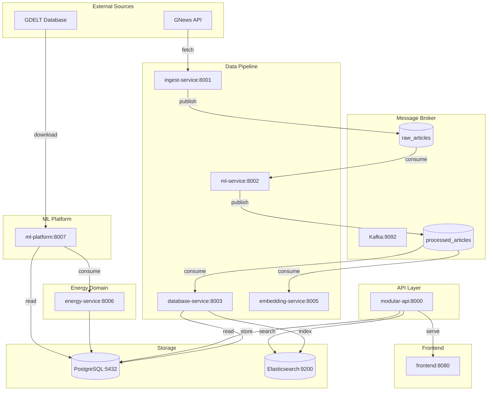
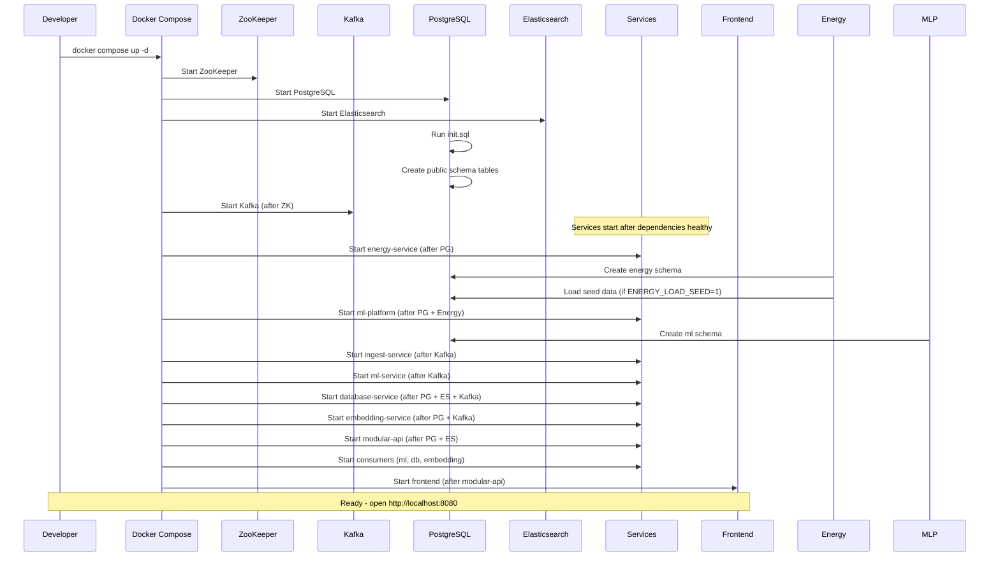
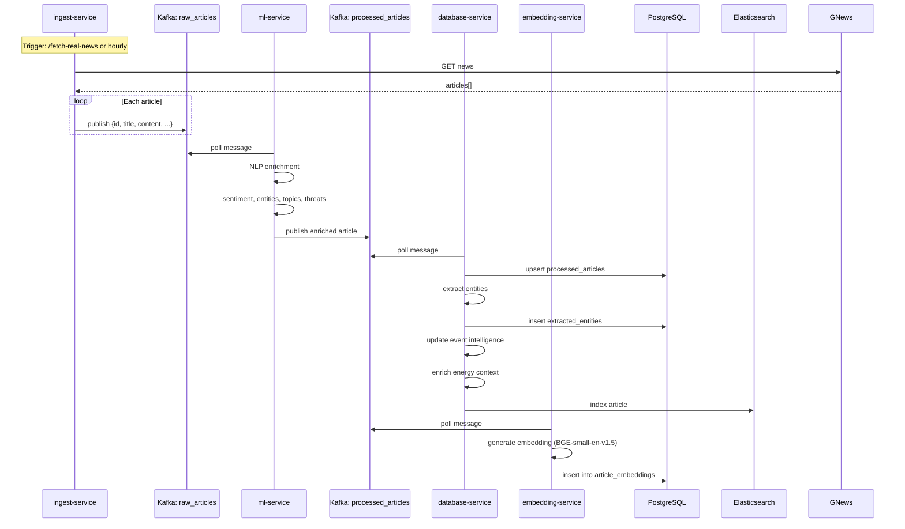
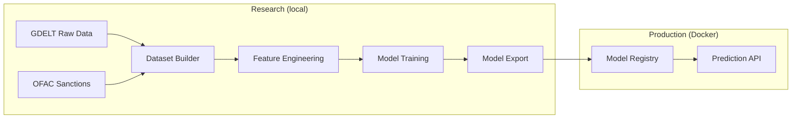
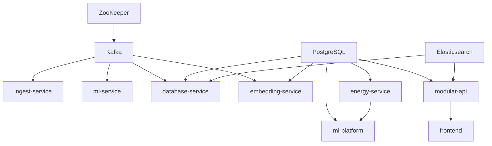

# ProxyDefence Developer Operations Handbook

> **Version:** 1.0.0  
> **Repository:** `git@github.com:anomalyco/ProxyDefence.git`  
> **Last Updated:** 2026-07-07  
> **Maintainer:** ProxyDefence Engineering Team  

---

## Table of Contents

1. [Project Overview](#1-project-overview)
2. [Folder Structure](#2-folder-structure)
3. [Environment Setup](#3-environment-setup)
4. [Virtual Environments](#4-virtual-environments)
5. [Environment Variables](#5-environment-variables)
6. [Docker](#6-docker)
7. [Complete Startup Guide](#7-complete-startup-guide)
8. [Running Individual Services](#8-running-individual-services)
9. [Research Workflow](#9-research-workflow)
10. [Kaggle Workflow](#10-kaggle-workflow)
11. [Dataset Workflow](#11-dataset-workflow)
12. [GDELT Workflow](#12-gdelt-workflow)
13. [Dataset Builders](#13-dataset-builders)
14. [ML Platform CLI](#14-ml-platform-cli)
15. [Model Training](#15-model-training)
16. [Manual Validation](#16-manual-validation)
17. [Database](#17-database)
18. [Kafka](#18-kafka)
19. [API Reference](#19-api-reference)
20. [Debugging Guide](#20-debugging-guide)
21. [Common Commands Cheat Sheet](#21-common-commands-cheat-sheet)
22. [Development Workflows](#22-development-workflows)
23. [Best Practices](#23-best-practices)
24. [Architecture Diagrams](#24-architecture-diagrams)
25. [Appendix](#25-appendix)

---

# 1. Project Overview

## 1.1 Purpose

ProxyDefence is a military-grade cyber defense intelligence platform that ingests global news, processes it through ML/NLP pipelines, stores the results in PostgreSQL and Elasticsearch, and serves intelligence through a React frontend and REST API. The platform extends into energy infrastructure risk analysis, strategic petroleum reserve (SPR) optimization, digital twin simulations, and production ML infrastructure.

## 1.2 Architecture

The platform uses an event-driven microservices architecture with Kafka as the message backbone. Data flows through the pipeline:

```
GNews API -> ingest-service -> Kafka (raw_articles)
                            -> ml-service -> Kafka (processed_articles)
                                             -> database-service -> PostgreSQL + Elasticsearch
                                                                  -> modular-api -> Frontend

Energy Service (port 8006) -> PostgreSQL (energy schema)
                          -> Standalone catalog; consumed by future services

ML Platform (port 8007) -> PostgreSQL (ml schema)
                        -> Consumes Energy Service data; serves prediction API

Research (research/) -> Jupyter notebooks -> Exported models -> ML Platform
                       (local, no Docker, pure experimentation)
```

## 1.3 Service Responsibilities

| Service | Port | Role |
|---------|------|------|
| **ingest-service** | 8001 | Fetches news from GNews API every hour, publishes raw articles to `raw_articles` Kafka topic |
| **ml-service** | 8002 | Subscribes to `raw_articles`, performs NLP (sentiment, entities, topics, threats), publishes to `processed_articles` |
| **database-service** | 8003 | Consumes `processed_articles`, stores in PostgreSQL, indexes in Elasticsearch, provides REST API for articles/analytics/search |
| **embedding-service** | 8005 | Consumes `processed_articles`, generates vector embeddings using BGE-small-en-v1.5, stores in pgvector |
| **energy-service** | 8006 | Standalone energy infrastructure catalog (14 entity types), risk intelligence, digital twin, SPR optimization, procurement orchestration |
| **ml-platform** | 8007 | Dataset builder, feature store, model training/registry, prediction API, drift monitoring, research framework |
| **modular-api** | 8000 | REST API gateway with 15+ domain routers, AI Copilot, RAG engine, authentication, rate limiting |
| **frontend** | 8080 | React 18 + TypeScript + Vite + Tailwind CSS + shadcn/ui + Recharts |

## 1.4 Data Pipeline Flow

1. **Ingest**: `GET /fetch-real-news` trigger (or hourly scheduler) fetches news from GNews API
2. **ML Enrichment**: ml-service Kafka consumer processes each raw article through:
   - Sentiment analysis (keyword-based: negative/positive/neutral)
   - Topic classification (conflict/energy/political/disaster/economic/cyber/technology/health)
   - Entity extraction (spaCy NER)
   - Threat scoring (0-100 based on sentiment, topic, entity count)
   - Relationship inference between entities
3. **Storage**: database-service consumer upserts to PostgreSQL `processed_articles` table, extracts entities, updates event intelligence, indexes in Elasticsearch
4. **Embeddings**: embedding-service consumer generates vector embeddings and stores in `article_embeddings` table
5. **Serving**: modular-api serves data to frontend with JWT authentication

---

# 2. Folder Structure

## 2.1 Repository Root

```
C:\ProxyWars\ProxyDefence\
├── backend/              # Shared Python modules + API application
├── datasets/             # Data lake - raw, processed, normalized, training data
├── docs/                 # Documentation (70+ documents)
├── infra/                # Infrastructure - SQL schemas, Docker config
├── logs/                 # Runtime logs (auto-created)
├── research/             # ML research environment (local, no Docker)
├── scripts/              # Development, maintenance, testing scripts
├── services/             # Microservices (one subdirectory per service)
├── tests/                # Integration and unit tests
├── validation/           # Validation framework
├── .env.example          # Environment variable template
├── .env                  # Local environment variables (gitignored)
├── docker-compose.yml    # Infrastructure only (PostgreSQL, Kafka, ES)
├── docker-compose.full.yml  # Full stack (infrastructure + all services)
├── Makefile              # Cross-platform build/dev commands
├── pyproject.toml        # Python tool configuration (ruff, pytest, coverage, pyright)
├── alembic.ini           # Alembic migration configuration
├── CLAUDE.md             # AI assistant guidance
└── dataset_inventory.py  # Dataset inventory tooling
```

## 2.2 `backend/` -- Shared Python Modules and API

```
backend/
├── api/                  # FastAPI application with domain routers
│   ├── agents/           # AI agent router + supervisor + specialist interfaces
│   ├── alerts/           # Alert repository, router, schema, service
│   ├── analytics/        # Analytics endpoints
│   ├── articles/         # Article CRUD endpoints
│   ├── auth/             # JWT authentication (register/login/me)
│   ├── cases/            # Investigation case management
│   ├── common/           # Shared dependencies, error handlers, schemas
│   ├── copilot/          # AI Copilot chat (conversation + RAG)
│   ├── energy/           # Energy service proxy router + intelligence router
│   ├── entities/         # Extracted entity endpoints
│   ├── events/           # Event intelligence endpoints
│   ├── graph/            # Knowledge graph endpoints
│   ├── health/           # Health check endpoint
│   ├── rag/              # RAG engine (retrieval, context, citations)
│   ├── reports/          # Intelligence report generation
│   ├── search/           # Elasticsearch + vector search
│   ├── tools/            # Agent tool registry (analytics, energy, graph, intelligence, search)
│   └── watchlists/       # Entity watchlist management
├── api_service/          # Application wiring (main.py, rate limiting, security)
│   ├── main.py           # Only re-exports backend.api.app:app
│   ├── rate_limit.py     # SlowAPI rate limiter configuration
│   ├── security.py       # Current user dependency
│   └── repositories/     # Intelligence audit repository
└── shared/               # Shared across all microservices
    ├── config.py         # .env auto-loader, SERVICE_VERSION, GIT_COMMIT
    ├── settings.py       # Single source of truth for all env var parsing
    ├── paths.py          # Canonical path resolution (project_root, infra_sql, service_dir)
    ├── connection.py     # PostgreSQL connection helpers
    ├── db_pool.py        # Asyncpg pool singleton
    ├── elastic_client.py # Elasticsearch async client singleton
    ├── logging_config.py # structlog configuration
    ├── request_middleware.py  # Request ID tracking middleware
    ├── schema_bootstrap.py    # Schema initialization
    ├── shutdown.py       # Graceful shutdown utilities
    ├── entity_normalization.py  # Entity text normalization
    ├── kafka_monitor.py  # Kafka health monitoring
    ├── kafka/            # Kafka utilities
    │   ├── __init__.py   # producer_config, consumer_config, KAFKA_BOOTSTRAP_SERVERS
    │   ├── producer.py   # JsonProducer class
    │   ├── consumer.py   # ConsumerRunner class + signal handlers
    │   ├── health.py     # Kafka connection health check
    │   ├── serialization.py  # JSON serializer/deserializer
    │   └── topics.py     # Canonical topic definitions + ensure_topics()
    ├── database/         # Database utilities
    │   ├── pool.py       # Pool wrapper class
    │   ├── postgres.py   # PostgreSQL async operations
    │   ├── migrations.py # Migration utilities
    │   └── transactions.py   # Transaction helpers
    ├── observability/    # Metrics and monitoring
    │   ├── health.py     # HealthBuilder, StartupTimer
    │   ├── metrics.py    # Prometheus metric definitions
    │   └── startup.py    # Startup diagnostics
    ├── resilience/       # Resilience patterns
    │   ├── circuit_breaker.py
    │   ├── bulkhead.py
    │   ├── retry.py
    │   └── timeout.py
    ├── llm/              # LLM client (Groq/OpenAI-compatible)
    │   ├── client.py     # LLMClient with streaming, tool calling
    │   ├── config.py     # Model configuration
    │   ├── schemas.py    # Pydantic response schemas
    │   ├── prompts.py    # Prompt templates
    │   ├── memory.py     # Conversation memory
    │   ├── utils.py      # Token counting, cost estimation
    │   └── exceptions.py # LLM error types
    ├── orchestration/    # AI orchestration engine
    │   ├── engine.py     # Orchestration engine
    │   ├── planner.py    # Task planner
    │   ├── reasoning.py  # Chain-of-thought reasoning
    │   ├── reflection.py # Self-reflection
    │   ├── router.py     # Agent router
    │   ├── confidence.py # Confidence scoring
    │   ├── citations.py  # Citation management
    │   └── trace.py      # Execution tracing
    ├── memory/           # Agent memory system
    │   ├── agent.py      # Agent memory
    │   ├── conversation.py   # Conversation memory
    │   ├── execution.py  # Execution memory
    │   └── compression.py    # Memory compression
    ├── prompts/          # System prompts for AI agents
    │   ├── system.py     # System prompt
    │   ├── planning.py   # Planning prompt
    │   ├── validation.py # Validation prompt
    │   ├── reflection.py # Reflection prompt
    │   └── executive.py  # Executive prompt
    ├── migrations/       # Alembic migrations
    │   ├── env.py
    │   ├── script.py.mako
    │   └── versions/     # 6 migration versions
    │       ├── 0001_initial_schema.py
    │       ├── 0002_add_copilot_tables.py
    │       ├── 0003_energy_domain.py
    │       ├── 0004_ml_platform.py
    │       ├── 0005_energy_intelligence.py
    │       └── 0006_energy_intelligence.py
    └── dlq.py            # Dead letter queue handler
```

## 2.3 `services/` -- Microservices

Each microservice follows a consistent pattern:

```
services/<service-name>/
├── .venv/                # Python virtual environment (gitignored)
├── app.py                # FastAPI application
├── config.py             # Service-specific configuration (re-exports from backend.shared.settings)
├── db.py                 # Database pool management (energy-service, embedding-service, ml-platform)
├── consumer.py           # Kafka consumer (ml-service, database-service, embedding-service)
├── requirements.txt      # Python dependencies
├── Dockerfile            # Container build
└── services/             # Business logic modules
    └── *.py
```

**Never place**: Runtime-generated files, notebooks, research scripts, test fixtures, or environment-specific secrets.

### 2.3.1 `services/ingest-service/`
- `app.py`: FastAPI with BackgroundScheduler (hourly news fetch), Prometheus metrics
- `producer.py`: JsonProducer wrapper
- `services/news_fetcher.py`: GNews API client
- **No db.py** -- uses Kafka only

### 2.3.2 `services/ml-service/`
- `app.py`: FastAPI with on_startup model loading, inline Kafka consumer (runs as daemon)
- `consumer.py`: Standalone Kafka consumer using ConsumerRunner
- `ml_core/`: NLP modules -- sentiment, entities, relationships, threat scoring, topic classification, text summarization
- No `config.py` or `db.py` -- reads KAFKA_BOOTSTRAP_SERVERS from env inline

### 2.3.3 `services/database-service/`
- `app.py`: FastAPI with REST endpoints for articles, analytics, search, event rebuild
- `consumer.py`: Standalone ConsumerRunner that stores articles, enriches entities/events/energy context, indexes in ES
- `db.py`: psycopg2 connection pool (sync)
- `services/database.py`: Article CRUD operations
- `services/elastic_indexer.py`: Elasticsearch indexing + search
- `services/event_intelligence.py`: Event clustering and intelligence
- `services/energy_enrichment.py`: Energy context enrichment

### 2.3.4 `services/embedding-service/`
- `app.py`: FastAPI with semantic search, embedding generation endpoints
- `consumer.py`: Async Kafka consumer using ConsumerRunner + asyncpg
- `db.py`: asyncpg connection pool
- `services/embeddings.py`: BGE-small-en-v1.5 model wrapper using fastembed

### 2.3.5 `services/energy-service/`
- `app.py`: FastAPI with 8 sub-routers (catalog, relationships, events, history, bulk, intelligence, digital_twin, procurement)
- `db.py`: asyncpg connection pool
- `models.py`: Pydantic models for 14+ entity types
- `filters.py`: Standardized filtering (search, sort, status, criticality, org, location, tag)
- `seed.py`: Idempotent seed data loader
- `seed_data/`: JSON seed files for all entity types (17 files)
- `routers/`: catalog.py, bulk.py, relationships.py, events.py, history.py, intelligence.py, digital_twin.py, procurement.py
- `parsers/`: base.py, csv_parser.py, json_parser.py, geojson_parser.py
- `services/`: risk_engine.py, ml_bridge.py, digital_twin/ (engine.py, flow.py, graph.py, scenarios.py), procurement/ (compatibility.py, optimizer.py, orchestrator.py, spr_engine.py, supplier_intel.py)

### 2.3.6 `services/ml-platform/`
- **Largest service** -- 40+ routers, full CLI, data acquisition pipeline, dataset factory, feature store, model registry, research framework
- `app.py`: FastAPI with 30+ routers
- `config.py`: ML Platform specific env vars
- `db.py`: asyncpg pool, schema ensure
- `models.py`: All Pydantic models for API requests/responses
- `cli/main.py`: Complete CLI for data operations (800+ lines)
- `data_acquisition/`: Source registry, download manager, GDELT pipeline, parsers for 16+ sources
- `dataset_factory/`: Framework, builders, cleaning, EDA, exporters, feature validation
- `feature_store/`: Registry, transforms, groups, importance, materialization, cache, monitoring
- `training/`: Experiment runner, model factory, optimization
- `inference/`: Predictor service
- `registry/`: Model registry
- `research/`: Cross-validation, evaluation, experiment runner, explainability, hyperparameter search, leaderboard, model cards, report generation, model factory, trainers
- `monitoring/`: Drift detection, alerts, monitoring
- `evaluation/`: Classification, regression, reporting
- `normalization/`: 13+ normalization rule types
- `connectors/`: REST, database, file, message, storage, archive connectors
- `ingestion/`: Pipeline engine, scheduler, error handling
- `quality/`: Data quality scoring, reporting, dashboard
- `pipeline/`: DAG, execution, preprocessing, feature selection, caching, detection, explainability, export, reporting
- `tests/`: 30+ test files covering all subsystems

### 2.3.7 `services/modular-api/`
- No Python files directly -- Dockerfile CMD points to `backend.api_service.main:app`
- See `backend/api/app.py` for the actual application

### 2.3.8 `services/frontend/`
- React 18 + TypeScript + Vite 5.4 + Tailwind CSS 3.4
- 49 shadcn/ui components (Radix UI primitives)
- 30+ page components across 15 domains
- Axios-based API client in `src/lib/api.ts`
- React Router 6 for client-side routing
- TanStack Query for data fetching
- React Hook Form + Zod for forms
- Recharts for charts
- Lucide React for icons
- nginx.conf for production deployment
- Vite dev server runs on port 8080

## 2.4 `infra/` -- Infrastructure

```
infra/
└── sql/                  # Canonical SQL schema DDL
    ├── init.sql          # Public schema (articles, entities, events, users, alerts, cases, copilot, embeddings)
    ├── energy_schema.sql # Energy domain schema (14 entity tables, 9 ENUMs, indexes)
    ├── ml_schema.sql     # ML platform schema (35+ tables across features, datasets, models, connectors, ingestion, quality)
    ├── energy_intelligence_schema.sql  # Risk scoring, disruption signals, commodity prices, AIS, sanctions
    ├── digital_twin_schema.sql        # Network graph, simulation, flow tracking, demand profiles
    ├── procurement_schema.sql         # Supplier intelligence, refinery compatibility, route costs, RFQ, SPR optimization
    └── spr_schema.sql                 # SPR facilities, inventory, release/refill plans, policies, decision timeline
```

**Never place**: Runtime SQL, auto-generated migrations, application logs, or non-DDL files.

## 2.5 `research/` -- ML Research

```
research/
├── .venv/                # Research environment (gitignored)
├── datasets/             # Data fetching and builder scripts
│   ├── geopolitical_risk_builder.py  # Complete GDELT-based risk dataset builder
│   ├── country_mapper.py             # FIPS->ISO3, name->ISO3 with fuzzy matching
│   ├── download_gdelt.py            # Async GDELT download via ML Platform pipeline
│   ├── download_gdelt_direct.py     # Direct GDELT download from master file list
│   ├── fetch_data.py                # Energy Service data fetcher (or synthetic fallback)
│   └── geopolitical_risk_v1/        # Generated dataset files
├── experiments/          # Training scripts
│   ├── baseline_models.py           # LogReg, RF, XGBoost training
│   └── baseline_results/            # Results JSON and CSV
├── notebooks/            # Jupyter notebooks (01 through 08)
├── configs/              # YAML experiment configs
├── reports/              # Design docs, cards, catalogs, checklists
├── inventory/            # Data inventory and source studies
├── models/               # Exported model artifacts
├── artifacts/            # Experiment artifacts
├── requirements-research.txt  # Full ML stack dependencies
└── DATASET_BUILDER_GUIDE.md
```

**Never place**: Production code, FastAPI applications, Docker-related files, service configurations, or secrets.

## 2.6 `scripts/` -- Development Scripts

```
scripts/
├── check-env.py          # Python env validation
├── pipeline-status.ps1   # Pipeline health check
├── pipeline-test.ps1     # Pipeline integration test
├── reset-db.ps1          # Database reset utility
├── seed-demo-data.ps1    # Demo data seeding
├── dev/                  # Development environment scripts
│   ├── setup/
│   │   ├── setup.ps1     # One-time setup (venvs, deps, spaCy, .env)
│   │   └── setup.sh      # Linux/macOS equivalent
│   ├── infrastructure/
│   │   ├── start-infra.ps1   # docker compose up -d
│   │   ├── stop-infra.ps1    # docker compose down
│   │   ├── restart-infra.ps1 # docker compose restart
│   │   └── *.sh              # Linux equivalents
│   ├── backend/
│   │   ├── start-all.ps1     # Launch all 7 services + consumers in separate windows
│   │   ├── start-<service>.ps1  # Individual service launchers
│   │   ├── start-consumers.ps1  # Launch all 3 Kafka consumers
│   │   └── *.sh                # Linux equivalents
│   ├── frontend/
│   │   ├── start-frontend.ps1  # Vite dev server launcher
│   │   └── start-frontend.sh
│   ├── common/             # Shared script utilities
│   │   ├── colors.ps1      # ANSI color helpers
│   │   ├── load-env.ps1    # .env file loader
│   │   ├── paths.ps1       # Path resolution + port maps + health URLs
│   │   └── port-utils.ps1  # Port check, wait, and process finders
│   ├── start-local.ps1     # Complete environment launcher (947 lines)
│   ├── stop-local.ps1      # Kill all local dev processes
│   ├── restart-local.ps1   # Stop then start
│   ├── status.ps1          # Health check all services
│   ├── start-api.ps1       # Start only API services
│   ├── start-consumers.ps1 # Start only consumers
│   ├── start-frontend.ps1  # Start frontend only
│   └── logs.ps1            # Log viewer
├── maintenance/
│   ├── clean.ps1           # Clean pycache, logs, caches
│   └── reset.ps1           # Full reset (clean + docker down + rm venvs)
└── testing/
    ├── run-tests.ps1       # Test runner
    └── run-tests.sh
```

## 2.7 `tests/` -- Test Suite

```
tests/
├── conftest.py            # Root pytest configuration
├── pytest.ini             # Pytest settings
├── requirements-test.txt  # Test dependencies
├── factories/             # Test data factories (alerts, articles, cases, entities, events, users)
├── fixtures/              # Test fixtures (articles, auth, ES, Kafka)
├── mocks/                 # Mock objects (db, es, kafka, ml_service)
├── sample_data/           # Sample data files (articles, entities, events, users)
├── unit/                  # Unit tests
│   ├── api/               # API unit tests (entity_normalization, middleware, security)
│   ├── database/          # Database unit tests (migrations, pool, postgres, transactions)
│   ├── kafka/             # Kafka unit tests (consumer, health, producer, serialization, topics)
│   └── observability/     # Observability unit tests (health, metrics, startup)
├── integration/           # Integration tests (requires PG + ES running)
│   ├── test_alerts_api.py
│   ├── test_analytics_api.py
│   ├── test_articles_api.py
│   ├── test_auth_api.py
│   ├── test_cases_api.py
│   ├── test_data_pipeline.py
│   ├── test_entities_api.py
│   ├── test_events_api.py
│   ├── test_graph_api.py
│   ├── test_health_api.py
│   ├── test_migrations.py
│   ├── test_reports_api.py
│   ├── test_search_api.py
│   └── test_watchlists_api.py
├── test_auth.py
├── test_health.py
├── test_digital_twin_validation.py
├── test_procurement_validation.py
├── test_risk_intelligence_validation.py
├── test_spr_validation.py
├── debug_endpoint.py
├── run_procurement_tests.py
└── run_spr_tests.py
```

**Never place**: Production credentials, large data files, binary artifacts, or Dockerfiles.

## 2.8 `datasets/` -- Data Lake

```
datasets/
├── raw/                  # Raw source data
│   ├── gdelt/            # GDELT event/mentions/GKG data by date
│   │   ├── events/20240101/...      # ~88+ daily directories
│   │   ├── mentions/20240101/...
│   │   └── gkg/20240101/...
│   ├── gem-data/         # Global Energy Monitor tracker data (34+ xlsx/zip files)
│   ├── sdn.csv           # OFAC SDN sanctions list
│   ├── ports.csv         # World port index
│   ├── global_energy_2025.csv
│   ├── global_energy_2026.csv
│   ├── AEO2023/          # Annual Energy Outlook
│   ├── AEO2025.zip
│   ├── AEO2026.zip
│   ├── Gas-Finance-Tracker-Data-December-2025.xlsx
│   ├── GEM-GGIT-Gas-Pipelines-2025-11.xlsx
│   ├── GEM-GOIT-Oil-NGL-Pipelines-2026-06.xlsx
│   ├── Global Coal Mine Tracker, May 2026__.xlsx
│   ├── LNG-Carrier-Tracker-December-2025-release.xlsx
│   └── (various other raw data)
├── processed/            # Processed/parsed data
│   └── gdelt/            # Parsed GDELT output by type/date
├── normalized/           # Normalized data (empty)
├── features/             # Feature store (empty)
├── registry/             # Dataset registry (empty)
└── training/             # Training datasets (empty)
```

## 2.9 `validation/` -- Validation Framework

```
validation/
├── base_check.py         # Base check class
├── config.py             # Validation configuration
├── report.py             # Report generation
├── runner.py             # Validation runner
├── checks/               # Individual validation checks
│   ├── ai_layer.py
│   ├── data_pipeline.py
│   ├── datasets.py
│   ├── feature_store.py
│   ├── frontend.py
│   ├── gdelt.py
│   ├── inference.py
│   ├── infrastructure.py
│   ├── model_registry.py
│   └── services.py
└── templates/            # Report templates (empty)
```

## 2.10 `docs/` -- Documentation

70 documents covering every subsystem. Key documents:

| Document | Contents |
|----------|----------|
| `ARCHITECTURE.md` | Full architecture reference (15 parts, 12 sequence diagrams) |
| `AI_ARCHITECTURE.md` | AI Copilot agent architecture |
| `AI_ORCHESTRATION_ARCHITECTURE.md` | Orchestration engine design |
| `DATABASE_GUIDE.md` | 7 schemas, 75+ tables documented |
| `SERVICE_GUIDE.md` | Per-service configuration |
| `KAFKA_GUIDE.md` | Kafka topic and consumer guide |
| `LOCAL_DEVELOPMENT.md` | Development setup walkthrough |
| `STARTUP_RUNBOOK.md` | Production startup procedures |
| `ENERGY_RUNBOOK.md` | Energy service operations |
| `ML_PLATFORM_ARCHITECTURE_v2.md` | ML Platform design |
| `DATASET_LIFECYCLE.md` | Dataset management lifecycle |
| `GDELT_PIPELINE_VALIDATION.md` | GDELT pipeline validation |
| `DEPLOYMENT.md` | Production deployment guide |
| `SEQUENCE_DIAGRAMS.md` | Sequence diagrams |
| `EXECUTION_SEQUENCE_DIAGRAMS.md` | Execution sequence diagrams |
| `CONSTITUTION.md` | Project constitution/documentation standards |
| `PROJECT_IMPLEMENTATION_AUDIT.md` | Implementation audit report |
| `FINAL_INFRASTRUCTURE_VALIDATION.md` | Infrastructure validation report |

---

# 3. Environment Setup

## 3.1 Windows Requirements

| Dependency | Minimum Version | Verified By |
|------------|----------------|-------------|
| Windows 10/11 | 10.0.19041+ | OS version |
| PowerShell | 5.0+ | `$PSVersionTable.PSVersion` |
| Python | 3.10+ | `python --version` |
| Node.js | 18+ | `node --version` |
| npm | 8+ | `npm --version` |
| Docker Desktop | 4.0+ | `docker --version` |
| Docker Compose | v2 (plugin) | `docker compose version` |
| Git | 2.30+ | `git --version` |

## 3.2 Linux/WSL Requirements

| Dependency | Minimum Version | Verified By |
|------------|----------------|-------------|
| Ubuntu 22.04+ / Debian 12+ | - | `lsb_release -a` |
| Python | 3.10+ | `python3 --version` |
| Node.js | 18+ | `node --version` |
| Docker Engine | 24+ | `docker --version` |
| Docker Compose Plugin | v2 | `docker compose version` |
| Git | 2.30+ | `git --version` |
| Make | 3.81+ | `make --version` |
| pwsh (PowerShell 7) | 7.0+ | `pwsh --version` |

## 3.3 Python Environment

**Required for all OS**: Python 3.10 or later. Python 3.11 is the target version (configured in `pyproject.toml`).

Install Python 3.11 from [python.org](https://www.python.org/downloads/) or via your package manager.

## 3.4 PostgreSQL Client

Not strictly required for development (Docker provides the server), but useful:
- `pg_isready` for health checks
- `psql` for interactive queries
- Install via `choco install postgresql` (Windows) or `apt install postgresql-client` (Linux)

## 3.5 Kafka Client (Optional)

- `kafka-topics.bat` / `kafka-topics.sh` for topic management
- Available via Kafka distribution or Docker exec: `docker exec kafka kafka-topics --list --bootstrap-server localhost:9092`

## 3.6 Elasticsearch Client (Optional)

- `curl` is sufficient for health checks: `curl -u elastic:password http://localhost:9200/`

## 3.7 One-time Setup Command

```powershell
# Windows PowerShell (run as Administrator recommended for Docker)
.\scripts\dev\setup\setup.ps1
```

This script:
1. Verifies Python 3.10+
2. Verifies Docker CLI
3. Creates `.env` from `.env.example` if missing
4. Creates Python virtual environments for all 7 services
5. Installs dependencies in each venv from `requirements.txt`
6. Downloads spaCy `en_core_web_sm` model for ml-service
7. Installs shared dev dependencies (pytest, pytest-cov, pytest-asyncio, pytest-timeout, ruff, pyright)
8. Installs pre-commit hooks
9. Reports completion and next steps

```bash
# Linux/macOS
bash scripts/dev/setup/setup.sh
```

---

# 4. Virtual Environments

## 4.1 Production Environment

Each service has its own isolated `.venv` directory:

| Service | Venv Path | Requirements |
|---------|-----------|-------------|
| ingest-service | `services/ingest-service/.venv/` | `services/ingest-service/requirements.txt` |
| ml-service | `services/ml-service/.venv/` | `services/ml-service/requirements.txt` |
| database-service | `services/database-service/.venv/` | `services/database-service/requirements.txt` |
| embedding-service | `services/embedding-service/.venv/` | `services/embedding-service/requirements.txt` |
| energy-service | `services/energy-service/.venv/` | `services/energy-service/requirements.txt` |
| ml-platform | `services/ml-platform/.venv/` | `services/ml-platform/requirements.txt` |
| modular-api | `services/modular-api/.venv/` | `services/modular-api/requirements.txt` |

**Create**: `python -m venv services/<service>/.venv`

**Activate**: 
```powershell
# Windows
services/<service>/.venv/Scripts/Activate.ps1
# or use the Python executable directly:
services/<service>/.venv/Scripts/python.exe app.py
```

**When to use**: Running microservices for local development, debugging, or integration testing.

**Never**: Install research-only packages (mlflow, dvc, shap, optuna, lightgbm, jupyter) in these environments.

## 4.2 Research Environment

| File | Location |
|------|----------|
| Venv | `research/.venv/` |
| Requirements | `research/requirements-research.txt` |

**Create**:
```powershell
python -m venv research/.venv
research/.venv/Scripts/pip.exe install -r research/requirements-research.txt
```

**Activate**:
```powershell
# Windows
research/.venv/Scripts/Activate.ps1
```

**When to use**: Jupyter notebook development, ML experimentation, data analysis, model training with full ML stack.

**Installed packages**: mlflow, dvc, lightgbm, optuna, shap, pyarrow, jupyter, notebook, ipykernel, matplotlib, plotly, seaborn, scipy, statsmodels, prophet, requests

**Never**: Install these packages in production Docker images or service venvs.

## 4.3 Kaggle Environment

There is **no dedicated Kaggle environment** in this repository. Kaggle is used as a remote compute platform:
1. Export dataset (CSV/Parquet from research/datasets/)
2. Upload to Kaggle Dataset
3. Train models in Kaggle Notebook
4. Download model artifact
5. Register in ML Platform model registry

**When to use**: Large-scale training, hyperparameter optimization beyond local compute capacity.

## 4.4 Why Environments Are Separated

- **Production** (`services/*/requirements.txt`): Minimal dependencies for inference, API serving, data pipeline. Only installs what's needed to run the service in Docker.
- **Research** (`research/requirements-research.txt`): Full ML experimentation stack - training frameworks, visualization, experiment tracking, explainability.
- **Separation rule**: Research code NEVER becomes part of the Docker image. Notebooks NEVER execute inside containers. Docker is ONLY for production services.
- **Production only**: Loads models, preprocesses inputs, serves predictions.
- **Research only**: Training, tuning, SHAP, EDA, visualizations, hyperparameter search.

---

# 5. Environment Variables

## 5.1 Variable Catalog

| Variable | Required | Default | Service | Notes |
|----------|----------|---------|---------|-------|
| `POSTGRES_HOST` | No | `postgres` | All db-connected | Docker Compose service name |
| `POSTGRES_PORT` | No | `5432` | All db-connected | |
| `POSTGRES_DB` | No | `defenseintel` | All db-connected | |
| `POSTGRES_USER` | **Yes** | - | All db-connected | **Change default in production** |
| `POSTGRES_PASSWORD` | **Yes** | - | All db-connected | **Change default in production** |
| `ELASTICSEARCH_HOST` | No | `elasticsearch` | database-service, modular-api | |
| `ELASTICSEARCH_PORT` | No | `9200` | database-service, modular-api | |
| `ELASTICSEARCH_USER` | No | `elastic` | database-service, modular-api | |
| `ELASTICSEARCH_PASSWORD` | **Yes** | - | database-service, modular-api | **Change default in production** |
| `ELASTIC_PASSWORD` | **Yes** | - | docker-compose | Sets ES superuser password |
| `JWT_SECRET_KEY` | **Yes** | - | modular-api, database-service | **Change in production - use a long random string** |
| `JWT_ALGORITHM` | No | `HS256` | modular-api, database-service | |
| `ACCESS_TOKEN_EXPIRE_MINUTES` | No | `60` | modular-api | |
| `CORS_ORIGINS` | No | `http://localhost:3000,...` | modular-api | Comma-separated |
| `KAFKA_BOOTSTRAP_SERVERS` | No | `kafka:9092` | All Kafka-connected | Docker Compose in full.yml, `localhost:9092` in dev (docker-compose.yml) |
| `OPENAI_API_KEY` | **Yes** | - | modular-api (Copilot/Agents) | Groq API key starting with `gsk_` |
| `OPENAI_BASE_URL` | No | `https://api.groq.com/openai/v1` | modular-api | OpenAI-compatible provider |
| `LLM_DEFAULT_MODEL` | No | `llama-3.3-70b-versatile` | modular-api | |
| `LLM_FALLBACK_MODEL` | No | `llama-3.1-8b-instant` | modular-api | |
| `NEWS_API_KEY` | **Yes** | - | ingest-service | GNews API key from gnews.io |
| `VITE_API_URL` | No | `http://localhost:8000` | frontend | Build-time arg |
| `SERVICE_VERSION` | No | `1.0.0` | All services | |
| `GIT_COMMIT` | No | `unknown` | All services | |
| `ENVIRONMENT` | No | `development` | All services | |
| `ENERGY_LOAD_SEED` | No | `0` | energy-service | Set `1` to load seed data on startup |
| `MLFLOW_TRACKING_URI` | No | `file:./mlruns` | ml-platform | Local file-based MLflow |
| `DVC_REMOTE` | No | `./data/dvc-store` | ml-platform | Local DVC store |
| `ENERGY_SERVICE_URL` | No | `http://energy-service:8000` | ml-platform | In Docker; `http://localhost:8006` for local dev |
| `EMBEDDING_SERVICE_URL` | No | `http://embedding-service:8000` | modular-api | |
| `LOG_LEVEL` | No | `INFO` | All services | |
| `EMBEDDING_MODEL_NAME` | No | `BAAI/bge-small-en-v1.5` | embedding-service | |
| `DATASET_DIR` | No | `./data/datasets` | ml-platform | |
| `ARTIFACT_DIR` | No | `./data/artifacts` | ml-platform | |
| `REPORT_DIR` | No | `./data/reports` | ml-platform | |
| `DEFAULT_RANDOM_SEED` | No | `42` | ml-platform | |
| `DEFAULT_TEST_SIZE` | No | `0.2` | ml-platform | |
| `DEFAULT_VAL_SIZE` | No | `0.1` | ml-platform | |

## 5.2 Security Notes

1. **Never commit `.env` to version control** -- it is in `.gitignore`
2. **Change all defaults in production**: `POSTGRES_PASSWORD`, `ELASTIC_PASSWORD`, `JWT_SECRET_KEY`, `OPENAI_API_KEY`, `NEWS_API_KEY`
3. **JWT_SECRET_KEY**: Generate with: `python -c "import secrets; print(secrets.token_urlsafe(64))"`
4. **API keys**: Never hardcode in code. Use .env or Docker secrets.
5. **CORS Origins**: Restrict to known frontend URLs in production.

---

# 6. Docker

## 6.1 `docker-compose.yml` -- Infrastructure Only

| File | Purpose |
|------|---------|
| `docker-compose.yml` | Development - starts PostgreSQL, Kafka, Elasticsearch only |
| `docker-compose.full.yml` | Production - starts infrastructure + all microservices + frontend |

### Services in `docker-compose.yml`

| Service | Image | Port | Depends On |
|---------|-------|------|------------|
| `zookeeper` | `confluentinc/cp-zookeeper:7.4.0` | 2181 | - |
| `kafka` | `confluentinc/cp-kafka:7.4.0` | 9092 | zookeeper |
| `elasticsearch` | `docker.elastic.co/elasticsearch/elasticsearch:8.11.0` | 9200 | - |
| `postgres` | `pgvector/pgvector:pg15` | 5432 | - |

### Networks

- Single bridge network: `proxy_net`
- All containers attach to `proxy_net`

### Volumes

- `postgres_data`: Persists PostgreSQL data
- `elasticsearch_data`: Persists Elasticsearch data

### Health Checks

| Service | Check | Interval | Retries |
|---------|-------|----------|---------|
| `kafka` | `kafka-topics --list --bootstrap-server localhost:9092` | 10s | 5 |
| `elasticsearch` | `curl -u elastic:${ELASTIC_PASSWORD} http://localhost:9200/_cluster/health` | 10s | 10 |
| `postgres` | `pg_isready -U admin -d defenseintel` | 10s | 5 |

### ES Configuration

- Single-node discovery
- Security enabled
- HTTP SSL disabled (dev mode)
- JVM heap: 512MB min/max

### PostgreSQL Configuration

- Image: `pgvector/pgvector:pg15` (includes pgvector extension)
- Init SQL: `./infra/sql/init.sql` mounted to `/docker-entrypoint-initdb.d/init.sql`
- Auto-creates all public schema tables on first start

## 6.2 `docker-compose.full.yml` -- Full Stack

### Additional Services

| Service | Port | Build Context | Dockerfile | Depends On |
|---------|------|---------------|------------|------------|
| `ingest-service` | 8001 | `.` | `services/ingest-service/Dockerfile` | kafka (healthy) |
| `ml-service` | 8002 | `.` | `services/ml-service/Dockerfile` | kafka (healthy) |
| `ml-consumer` | - | `.` | `services/ml-service/Dockerfile` | kafka (healthy) |
| `embedding-service` | 8005 | `.` | `services/embedding-service/Dockerfile` | postgres, kafka |
| `embedding-consumer` | - | `.` | `services/embedding-service/Dockerfile` | postgres, kafka |
| `database-service` | 8003 | `.` | `services/database-service/Dockerfile` | kafka, postgres, elasticsearch |
| `db-consumer` | - | `.` | `services/database-service/Dockerfile` | kafka, postgres, elasticsearch |
| `modular-api` | 8000 | `.` | `services/modular-api/Dockerfile` | postgres, elasticsearch |
| `energy-service` | 8006 | `.` | `services/energy-service/Dockerfile` | postgres |
| `ml-platform` | 8007 | `.` | `services/ml-platform/Dockerfile` | postgres, energy-service |
| `frontend` | 3000 | `./services/frontend` | `Dockerfile` (in frontend dir) | modular-api |

### Startup Order (Full Stack)

1. **Infrastructure**: zookeeper -> kafka, postgres, elasticsearch
2. **Database consumers**: ml-consumer, db-consumer
3. **Services**: ingest-service, ml-service, database-service, embedding-service, embedding-consumer
4. **Energy stack**: energy-service -> ml-platform
5. **API gateway**: modular-api (depends on postgres + elasticsearch)
6. **Frontend**: frontend (depends on modular-api)

### Kafka in Full Stack

- Advertised listener: `PLAINTEXT://kafka:9092` (internal Docker network)
- Auto-create topics: enabled
- Partition count: 3 per topic

## 6.3 Dockerfiles

All Dockerfiles follow the same pattern:

```dockerfile
FROM python:3.12-slim
WORKDIR /app
COPY services/<service>/requirements.txt .
RUN pip install --no-cache-dir -r requirements.txt
COPY backend/ backend/
COPY services/<service>/ services/<service>/
CMD ["uvicorn", "<app-path>:app", "--host", "0.0.0.0", "--port", "8000"]
```

Key points:
- Base image: `python:3.12-slim`
- Working directory: `/app`
- Environment is **NOT** loaded from `.env` -- Docker Compose sets variables via `environment:` blocks
- PYTHONPATH is automatically `/app`

## 6.4 Port Mappings Summary

| Port | Service (docker-compose.yml) | Service (docker-compose.full.yml) |
|------|-----------------------------|-----------------------------------|
| 5432 | postgres | postgres |
| 9092 | kafka | kafka |
| 9200 | elasticsearch | elasticsearch |
| 8000 | - | modular-api |
| 8001 | - | ingest-service |
| 8002 | - | ml-service |
| 8003 | - | database-service |
| 8005 | - | embedding-service |
| 8006 | - | energy-service |
| 8007 | - | ml-platform |
| 3000 | - | frontend |

---

# 7. Complete Startup Guide

## 7.1 First-Time Setup (Zero to Running)

### Step 1: Clone and Configure

```powershell
# Clone repository
git clone <repo-url> ProxyDefence
cd ProxyDefence

# One-time setup
.\scripts\dev\setup\setup.ps1
```

**Expected output:**
```
=== ProxyDefence Development Setup ===
Python: Python 3.11.x
Docker: running
.env: created from .env.example
  >> Edit .env with your credentials <<

--- ingest-service ---
  .venv: created
  Dependencies: installed
... (same for ml-service, database-service, embedding-service, energy-service, ml-platform, modular-api)

--- spaCy Model (ml-service) ---
  spaCy model: downloaded

=== Setup Complete ===
All services configured successfully.
```

### Step 2: Edit `.env`

Edit `.env` and set required credentials:
- `POSTGRES_PASSWORD`
- `ELASTIC_PASSWORD`
- `JWT_SECRET_KEY`
- `NEWS_API_KEY` (get from https://gnews.io)
- `OPENAI_API_KEY` (get from https://console.groq.com)

### Step 3: Start Infrastructure

```powershell
.\scripts\dev\infrastructure\start-infra.ps1
```

**Expected output:**
```
Starting infrastructure services...
[+] Running 4/4
 ✔ Container zookeeper       Started
 ✔ Container kafka           Started
 ✔ Container elasticsearch   Started
 ✔ Container postgres-db     Started
Infrastructure started.
  PostgreSQL: localhost:5432
  Kafka:      localhost:9092
  Elasticsearch: localhost:9200
```

**Verify:**
```powershell
# PostgreSQL
docker exec postgres-db pg_isready -U admin -d defenseintel
# Expected: /var/run/postgresql:5432 - accepting connections

# Kafka
docker exec kafka kafka-topics --list --bootstrap-server localhost:9092
# Expected: (blank or topic list)

# Elasticsearch
curl -u elastic:change-me http://localhost:9200/
# Expected: {"name":"...", "cluster_name":"...", ...}
```

### Step 4: Start Backend Services

```powershell
# Option A: All in one (opens separate windows)
.\scripts\dev\backend\start-all.ps1

# Option B: Individual terminals (recommended for debugging)
.\scripts\dev\backend\start-ingest.ps1
.\scripts\dev\backend\start-ml.ps1
.\scripts\dev\backend\start-database.ps1
.\scripts\dev\backend\start-embedding.ps1
.\scripts\dev\backend\start-energy.ps1
.\scripts\dev\backend\start-ml-platform.ps1
.\scripts\dev\backend\start-modular-api.ps1
```

**Expected output per service (sample):**
```
=== ingest-service ===
INFO:     Started server process [12345]
INFO:     Waiting for application startup.
INFO:     ingest_service_starting
INFO:     ingest_service_started
INFO:     Application startup complete.
INFO:     Uvicorn running on http://0.0.0.0:8001 (Press CTRL+C to quit)
```

### Step 5: Start Consumers (in separate terminals)

```powershell
.\scripts\dev\backend\start-consumers.ps1
```

Opens 3 windows: ml-consumer, embedding-consumer, db-consumer

**Expected logs:**
```
ml-consumer:
  loading_models
  models_loaded
  consumer_initialized group=ml-service-group topic=raw_articles
  consumer_subscribed topic=raw_articles
```

### Step 6: Start Frontend

```powershell
.\scripts\dev\frontend\start-frontend.ps1
```

**Expected output:**
```
Starting frontend (Vite dev server)...

  VITE v5.x.x  ready in 500ms

  ➜  Local:   http://localhost:8080/
  ➜  Network: http://192.168.x.x:8080/
```

### Step 7: Trigger Data Pipeline

```powershell
curl http://localhost:8001/fetch-real-news
```

**Expected response:**
```json
{"message": "Fetched and sent 10 real news articles"}
```

### Step 8: Verify Full Pipeline

```powershell
# Check all service health endpoints
curl http://localhost:8000/health
curl http://localhost:8001/health
curl http://localhost:8002/health
curl http://localhost:8003/health
curl http://localhost:8005/health
curl http://localhost:8006/health
curl http://localhost:8007/health

# Query articles in database
curl http://localhost:8003/api/articles?limit=5

# Query articles via modular-api (requires auth)
curl -H "Authorization: Bearer <token>" http://localhost:8000/api/articles
```

## 7.2 All-in-One Launcher

The `start-local.ps1` script performs all steps 3-6 in sequence:

```powershell
.\scripts\dev\start-local.ps1
```

**Flags:**
- `-SkipInfra`: Skip Docker startup (if already running)
- `-SkipFrontend`: Skip Vite dev server
- `-SkipCleanup`: Skip killing old processes
- `-Force`: Non-interactive (auto-answer prompts)

**Phases:**
1. Pre-flight check (Python, Node, Docker, .env, venvs)
2. Process cleanup (kill old uvicorn, consumers, vite)
3. Port availability check
4. Infrastructure start (docker compose up -d)
5. Wait for PostgreSQL, Kafka, Elasticsearch
6. Environment setup (load .env, set PYTHONPATH)
7. Launch all 7 services sequentially
8. Launch 3 Kafka consumers
9. Launch frontend
10. Print summary with all URLs

## 7.3 Shutdown

```powershell
# Stop infrastructure (preserves data volumes)
.\scripts\dev\infrastructure\stop-infra.ps1

# Or full stop with process cleanup
.\scripts\dev\stop-local.ps1
```

---

# 8. Running Individual Services

## 8.1 Ingest Service

| Property | Value |
|----------|-------|
| **Working directory** | `services/ingest-service/` |
| **Command** | `uvicorn app:app --host 0.0.0.0 --port 8001 --reload` |
| **Script** | `scripts/dev/backend/start-ingest.ps1` |
| **Python venv** | `services/ingest-service/.venv/Scripts/python.exe` |
| **Health endpoint** | `GET http://localhost:8001/health` |
| **Expected logs** | `ingest_service_starting`, `ingest_service_started` |
| **Key endpoints** | `GET /fetch-real-news` (triggers fetch), `GET /` (status) |

**Common errors:**
- `Missing required environment variable: NEWS_API_KEY` -- Set NEWS_API_KEY in .env
- `Connection refused` -- Kafka not running, start infrastructure first

**Shutdown:** Ctrl+C in the terminal window

## 8.2 ML Service

| Property | Value |
|----------|-------|
| **Working directory** | `services/ml-service/` |
| **Command** | `uvicorn app:app --host 0.0.0.0 --port 8002 --reload` |
| **Script** | `scripts/dev/backend/start-ml.ps1` |
| **Python venv** | `services/ml-service/.venv/Scripts/python.exe` |
| **Health endpoint** | `GET http://localhost:8002/health` |
| **Expected logs** | `models_loaded`, `ML Service is Online` |
| **Consumer** | `python consumer.py` (separate process) |

**Common errors:**
- `ModuleNotFoundError: spacy` -- spaCy model not downloaded, run setup.ps1
- `NoBrokersAvailable` -- Kafka not running
- CUDA/GPU issues -- The service falls back to CPU automatically

**Shutdown:** Ctrl+C

## 8.3 Database Service

| Property | Value |
|----------|-------|
| **Working directory** | `services/database-service/` |
| **Command** | `uvicorn app:app --host 0.0.0.0 --port 8003 --reload` |
| **Script** | `scripts/dev/backend/start-database.ps1` |
| **Python venv** | `services/database-service/.venv/Scripts/python.exe` |
| **Health endpoint** | `GET http://localhost:8003/health` |
| **Expected logs** | `database_service_starting`, `database_service_ready` |
| **Consumer** | `python consumer.py` (separate process) |

**Common errors:**
- `OperationalError: connection to server at "localhost" (127.0.0.1), port 5432 failed: Connection refused` -- PostgreSQL not running
- `elasticsearch.exceptions.ConnectionError` -- Elasticsearch not running
- `JWTError` -- JWT_SECRET_KEY not set in .env

**Shutdown:** Ctrl+C

## 8.4 Embedding Service

| Property | Value |
|----------|-------|
| **Working directory** | `services/embedding-service/` |
| **Command** | `uvicorn app:app --host 0.0.0.0 --port 8005 --reload` |
| **Script** | `scripts/dev/backend/start-embedding.ps1` |
| **Python venv** | `services/embedding-service/.venv/Scripts/python.exe` |
| **Health endpoint** | `GET http://localhost:8005/health` |
| **Expected logs** | `embedding_service_starting`, `embedding_service_ready` |
| **Consumer** | `python consumer.py` (separate process) |

**Common errors:**
- `fastembed.common.model_management.ModelManagement.file_not_found` -- Model download failed on first run. The service downloads BGE-small-en-v1.5 automatically on first load.
- `asyncpg.exceptions.InvalidTableNameError` -- PostgreSQL not initialized or processed_articles table doesn't exist
- Memory issues -- BGE-small-en-v1.5 requires ~200MB RAM

**Shutdown:** Ctrl+C

## 8.5 Energy Service

| Property | Value |
|----------|-------|
| **Working directory** | `services/energy-service/` |
| **Command** | `uvicorn app:app --host 0.0.0.0 --port 8006 --reload` |
| **Script** | `scripts/dev/backend/start-energy.ps1` |
| **Python venv** | `services/energy-service/.venv/Scripts/python.exe` |
| **Health endpoint** | `GET http://localhost:8006/health` |
| **Swagger** | `http://localhost:8006/docs` |
| **Expected logs** | `energy-service ready` |

**Seed data:** Set `ENERGY_LOAD_SEED=1` in .env to load seed data on startup (17 JSON files in `seed_data/`)

**Common errors:**
- `asyncpg.exceptions.InvalidSchemaNameError` -- energy schema not created. The service runs `energy_schema.sql` automatically via bootstrap.
- Duplicate key violations on seed data -- Safe to ignore (uses ON CONFLICT DO NOTHING)

**Shutdown:** Ctrl+C

## 8.6 ML Platform

| Property | Value |
|----------|-------|
| **Working directory** | `services/ml-platform/` |
| **Command** | `uvicorn app:app --host 0.0.0.0 --port 8007 --reload` |
| **Script** | `scripts/dev/backend/start-ml-platform.ps1` |
| **Python venv** | `services/ml-platform/.venv/Scripts/python.exe` |
| **Health endpoint** | `GET http://localhost:8007/health` |
| **Swagger** | `http://localhost:8007/docs` |
| **CLI** | `python -m cli.main <command>` |
| **Expected logs** | `ml-platform ready` |

**Common errors:**
- `asyncpg.exceptions.InvalidSchemaNameError` -- ml schema not created. The service runs `ml_schema.sql` automatically.
- Energy service unreachable -- Set `ENERGY_SERVICE_URL=http://localhost:8006` in .env

**Shutdown:** Ctrl+C

## 8.7 Modular API

| Property | Value |
|----------|-------|
| **Working directory** | `services/modular-api/` (but runs from repo root) |
| **Command** | `uvicorn backend.api_service.main:app --host 0.0.0.0 --port 8000 --reload` |
| **Script** | `scripts/dev/backend/start-modular-api.ps1` |
| **Python venv** | `services/modular-api/.venv/Scripts/python.exe` |
| **Health endpoint** | `GET http://localhost:8000/health` |
| **Swagger** | `http://localhost:8000/docs` |
| **Expected logs** | `Starting modular-api service` |

**Common errors:**
- `ModuleNotFoundError` -- PYTHONPATH must be set to repo root (script handles this)
- PostgreSQL connection refused -- PostgreSQL must be running
- Elasticsearch connection refused -- Elasticsearch must be running
- Rate limit exceeded -- Default is 100 requests/minute per endpoint

**Shutdown:** Ctrl+C

## 8.8 Frontend

| Property | Value |
|----------|-------|
| **Working directory** | `services/frontend/` |
| **Command** | `npm run dev` |
| **Script** | `scripts/dev/frontend/start-frontend.ps1` |
| **Health** | Open `http://localhost:8080` in browser |
| **Expected output** | `VITE ready in 500ms -> Local: http://localhost:8080/` |

**Common errors:**
- `'npm' is not recognized` -- Node.js not installed
- `Module not found` -- Run `npm install` in `services/frontend/`
- CORS errors in browser -- Check `VITE_API_URL` in `services/frontend/.env` matches modular-api port

**Shutdown:** Ctrl+C

---

# 9. Research Workflow

## 9.1 Environment Setup

```powershell
# Create research virtual environment
python -m venv research/.venv

# Install research dependencies
research/.venv/Scripts/pip.exe install -r research/requirements-research.txt
```

**Never** install `services/ml-platform/requirements.txt` -- that file is for production Docker only.

## 9.2 Data Fetching

```powershell
# Fetch energy infrastructure data from running Energy Service
# Requires energy-service running on port 8006
$env:PYTHONPATH = "C:\path\to\repo"
research/.venv/Scripts/python.exe research/datasets/fetch_data.py
```

**Expected output:**
```
Fetching energy infrastructure data...
  locations: 250 records
  organizations: 120 records
  commodities: 45 records
  ports: 22 records
  ... (all 14 entity types)
Dataset saved: 1000 records, 45 features -> 'criticality_score'
```

**Fallback:** If Energy Service is unavailable, synthetic data is generated automatically.

**GDELT Data Download:**

```powershell
# Direct download (simpler, uses ThreadPoolExecutor)
research/.venv/Scripts/python.exe research/datasets/download_gdelt_direct.py

# Via ML Platform pipeline (async, full pipeline)
research/.venv/Scripts/python.exe research/datasets/download_gdelt.py
```

The direct download script:
1. Fetches the GDELT master file list from `data.gdeltproject.org`
2. Filters for export.CSV.zip files in the date range (default: 2024-01-01 to 2024-03-31)
3. Downloads missing files using `os.cpu_count()` parallel workers
4. Extracts ZIPs to `datasets/raw/gdelt/events/YYYYMMDD/extracted/`

## 9.3 Dataset Building

```powershell
# Build the geopolitical risk dataset (requires GDELT data downloaded)
$env:PYTHONPATH = "C:\path\to\repo"
research/.venv/Scripts/python.exe research/datasets/geopolitical_risk_builder.py
```

**Stages:**
1. Discover GDELT dates
2. Load and aggregate GDELT events in weekly batches
3. Load OFAC sanctions
4. Load ports data
5. Load global energy data and GEM trackers
6. Merge, engineer features, split (train/val/test)

**Output:** `research/datasets/geopolitical_risk_v1/` with parquet files + metadata.json

## 9.4 Jupyter Notebooks

```powershell
# Start Jupyter from the research directory
cd research
research/.venv/Scripts/jupyter.exe notebook
```

**Notebook workflow (execute in order):**

| # | Notebook | Purpose | Key Outputs |
|---|----------|---------|-------------|
| 01 | `01_eda.ipynb` | Exploratory Data Analysis | Distributions, correlations, target analysis |
| 02 | `02_preprocessing.ipynb` | Data Cleaning | Missing values, outliers, data types |
| 03 | `03_feature_engineering.ipynb` | Feature Engineering | Encoding, scaling, aggregation, selection |
| 04 | `04_baseline_models.ipynb` | Logistic Regression & Decision Trees | Decision boundaries, entropy, bias-variance |
| 05 | `05_model_comparison.ipynb` | Ensemble Methods | RF, XGBoost, LightGBM, cross-validation |
| 06 | `06_hyperparameter_tuning.ipynb` | Hyperparameter Optimization | Grid/Random search, Optuna |
| 07 | `07_explainability.ipynb` | Explainability | SHAP, feature importance, PDP |
| 08 | `08_final_model_export.ipynb` | Model Export | Final training, export, model card |

## 9.5 Baseline Model Training (Script)

```powershell
$env:PYTHONPATH = "C:\path\to\repo"
research/.venv/Scripts/python.exe research/experiments/baseline_models.py
```

**Expected output (sample):**
```
Loading dataset...
Dataset loaded: 5953 rows, 224 countries, 82 features
Training Logistic Regression...
  Accuracy: 0.918
  Precision: 0.772
  Recall: 0.765
  F1: 0.768
  ROC AUC: 0.968
Training Random Forest...
  Accuracy: 1.000 (suspicious - likely overfitting)
Training XGBoost...
  Accuracy: 1.000 (suspicious - likely overfitting)
Results saved to research/experiments/baseline_results/
```

## 9.6 Experiment Tracking

Research notebooks use MLflow for experiment tracking (local file-based):

```powershell
# View MLflow UI (from research directory)
research/.venv/Scripts/mlflow.exe ui
# Opens at http://localhost:5000
```

---

# 10. Kaggle Workflow

Kaggle is used as remote compute for large-scale training. This is **not** a production environment.

## 10.1 Recommended Workflow

```
1. Export dataset from research/datasets/ as CSV/Parquet
2. Upload to Kaggle as a Kaggle Dataset
3. Create Kaggle Notebook using the dataset
4. Train models, run hyperparameter optimization
5. Download trained model artifact (.joblib, .pkl)
6. Register model in ML Platform registry
7. Deploy to production inference
```

## 10.2 Export Dataset

```powershell
# Export from research
$env:PYTHONPATH = "C:\path\to\repo"
research/.venv/Scripts/python.exe -c "
import pandas as pd
df = pd.read_parquet('research/datasets/geopolitical_risk_v1/geopolitical_risk_v1.parquet')
df.to_csv('research/datasets/geopolitical_risk_v1/export.csv', index=False)
"
```

## 10.3 Upload to Kaggle

```bash
# Requires kaggle API key (kaggle.json in ~/.kaggle/)
kaggle datasets create -p research/datasets/geopolitical_risk_v1/ -m "Geopolitical Risk Index v1"
```

## 10.4 Download Model from Kaggle

```bash
kaggle kernels output <user>/<notebook-name> -p research/models/
```

## 10.5 Register Model

```powershell
# Via ML Platform CLI
$env:PYTHONPATH = "C:\path\to\repo"
services/ml-platform/.venv/Scripts/python.exe -m cli.main import-model \
  --path research/models/best_model.joblib \
  --name "geopolitical_risk_classifier" \
  --type xgboost
```

**Never**: Treat Kaggle as production -- it is a research/compute platform only.

---

# 11. Dataset Workflow

## 11.1 Pipeline Stages

```
Raw Data (source -> raw/)
  ↓  Parse/Extract
Canonical (processed/)
  ↓  Normalize
Normalized (normalized/)
  ↓  Feature Engineering
Research Dataset (research/datasets/*/)
  ↓  Feature Transform
Training Dataset (datasets/training/)
  ↓  Train
Model (experiments/baseline_results/ or models/)
  ↓  Register
Registry (ML Platform model registry)
  ↓  Deploy
Inference (ML Platform prediction API)
```

## 11.2 Commands by Stage

### Raw Data Ingestion

```powershell
# GDELT events
research/.venv/Scripts/python.exe research/datasets/download_gdelt_direct.py

# Energy Service data (requires running energy-service)
research/.venv/Scripts/python.exe research/datasets/fetch_data.py
```

### Dataset Building

```powershell
# Geopolitical risk dataset
$env:PYTHONPATH = "C:\path\to\repo"
research/.venv/Scripts/python.exe research/datasets/geopolitical_risk_builder.py
```

### ML Platform Dataset Factory

```powershell
# Via CLI
$env:PYTHONPATH = "C:\path\to\repo"
services/ml-platform/.venv/Scripts/python.exe -m cli.main build-dataset \
  --dataset "geopolitical_risk" \
  --target "escalation_flag"
```

---

# 12. GDELT Workflow

## 12.1 Complete GDELT Pipeline

```
Master File (data.gdeltproject.org/gdeltv2/masterfilelist.txt)
  ↓
Filter (date range, type)
  ↓
Download (ZIP files to datasets/raw/gdelt/events/YYYYMMDD/)
  ↓
Extract (CSV from ZIP)
  ↓
Parse (tab-delimited -> DataFrame with named columns)
  ↓
Validate (row counts, schema, null rates)
  ↓
Register (in ML Platform dataset registry)
  ↓
Aggregate (events -> country-week aggregates)
  ↓
Feature Engineering (lags, rolling windows, cyclical encodings)
  ↓
Dataset Build (merge with OFAC, ports, energy data)
```

## 12.2 Commands

```powershell
# 1. Download (direct, parallel)
research/.venv/Scripts/python.exe research/datasets/download_gdelt_direct.py
# Supports date range filtering (start_date="20240101", end_date="20240331")
# Downloads to datasets/raw/gdelt/events/YYYYMMDD/extracted/YYYYMMDD.export.CSV

# 2. Build dataset (aggregation + feature engineering + merge)
$env:PYTHONPATH = "C:\path\to\repo"
research/.venv/Scripts/python.exe research/datasets/geopolitical_risk_builder.py

# 3. Via ML Platform GDELT pipeline (async, staged)
$env:PYTHONPATH = "C:\path\to\repo"
research/.venv/Scripts/python.exe research/datasets/download_gdelt.py
```

## 12.3 Expected Outputs

| Stage | Output | Location |
|-------|--------|----------|
| Master file | URL list | In-memory |
| Download | .CSV.zip files | `datasets/raw/gdelt/events/YYYYMMDD/` |
| Extract | .CSV files | `datasets/raw/gdelt/events/YYYYMMDD/extracted/` |
| Aggregate | Parquet dataset | `research/datasets/geopolitical_risk_v1/` |
| Metadata | metadata.json | `research/datasets/geopolitical_risk_v1/metadata.json` |

---

# 13. Dataset Builders

## 13.1 Geopolitical Risk Builder

| Property | Value |
|----------|-------|
| **File** | `research/datasets/geopolitical_risk_builder.py` |
| **Class** | `GeopoliticalRiskDatasetBuilder` |
| **Input** | GDELT CSV files in `datasets/raw/gdelt/events/` |
| **Output** | `research/datasets/geopolitical_risk_v1/*.parquet` |

**Stages shown in build output:**
1. `[1/6]` Discover GDELT dates
2. `[2/6]` Load and aggregate GDELT events in weekly batches
3. `[3/6]` Load OFAC sanctions (`datasets/raw/sdn.csv`)
4. `[4/6]` Load ports (`datasets/raw/ports.csv`)
5. `[5/6]` Load global energy and GEM trackers
6. `[6/6]` Merge, engineer, split

**Aggregation strategy**: Groups events by (country, year, ISO week) because GDELT `Day` column uses event date (not download date). Weekly batching ensures cross-week aggregation accuracy.

**Feature engineering**: Lag features (1-week, 4-week), rolling 4-week mean, week-over-week change, cyclical week encoding (sin/cos).

## 13.2 ML Platform Dataset Factory

| Property | Value |
|----------|-------|
| **Directory** | `services/ml-platform/dataset_factory/` |
| **Framework** | `DatasetFactory` class in `framework.py` |
| **Builders** | 13 builder types in `builders.py` |
| **Presets** | `build_preset()` in `builders.py` |

**Builder types:**

| Builder | Sources | Target Domain |
|---------|---------|-------------|
| `energy_infrastructure` | locations, orgs, commodities, ports, pipelines, refineries, power_plants, oil/gas fields | Infrastructure catalog |
| `news_articles` | processed_articles, extracted_entities, article_sentiments | News intelligence |
| `risk_signals` | drift_results, infrastructure_events, model_predictions | Risk assessment |
| `commodity_prices` | commodities, capacity_history, entity_relationships | Price forecasting |
| `spr` | strategic_petroleum_reserves, storage_facilities | SPR analytics |
| `procurement` | suppliers, entity_relationships | Procurement intelligence |
| `events` | infrastructure_events | Incident analysis |
| `entity_relationships` | entity_relationships | Relationship graphs |
| `knowledge_graph` | all entities + relationships | Graph analytics |
| `digital_twin` | all infrastructure + telemetry | Digital twin |
| `graph_embeddings` | entity_relationships | Graph ML features |
| `hybrid` | any combination of above | Multi-domain |

---

# 14. ML Platform CLI

## 14.1 Overview

The ML Platform CLI provides 30+ commands for data acquisition, dataset building, and model management.

**Entry point**: `services/ml-platform/.venv/Scripts/python.exe -m cli.main`

**Set PYTHONPATH before use**: `$env:PYTHONPATH = "C:\path\to\repo"`

**Exit codes**: `0` = success, `1` = failure

## 14.2 Command Reference

### `list sources`
Lists registered data sources in the source registry.

```powershell
python -m cli.main list sources
# Options: --category (filter by category)
```

**Expected output:**
```
name              display_name                 category              frequency   version   fields
GDELT             Global Database of Events    conflict_events       daily       2         58
OFAC_SDN          OFAC Specially Designated    sanctions             weekly      1         12
...
```

### `list datasets`
Lists available datasets.

```powershell
python -m cli.main list datasets
# Options: --category (filter)
```

### `list versions`
Lists downloaded versions for a source.

```powershell
python -m cli.main list versions --source GDELT
# Options: --source (required)
```

### `describe`
Shows detailed information about a source or dataset.

```powershell
python -m cli.main describe GDELT
python -m cli.main describe geopolitical_risk_v1
```

### `download`
Downloads data from a registered source.

```powershell
python -m cli.main download --source GDELT --version 2
# Options: --source (required), --version, --dry-run, --force
```

**Expected output:**
```
downloaded 'GDELT' version 2
  status:   completed
  files:    96
  size:     156.0 MB
  checksum: a1b2c3d4e5f6...
  duration: 45.3s
```

### `parse`
Parses raw data files.

```powershell
python -m cli.main parse --source GDELT --input-path datasets/raw/gdelt/events/20240101/
# Options: --source (required), --input-path (required), --output-dir, --version
```

### `register`
Registers a parsed dataset.

```powershell
python -m cli.main register --dataset-name gdelt_events_v2 --source GDELT --version 2 --path datasets/processed/gdelt/events/v2/
```

### `build`
Builds a dataset using registered data.

```powershell
python -m cli.main build --dataset-name geopolitical_risk_v2 --builder energy_infrastructure
```

### `build-dataset`
Full dataset factory build with all stages (normalize, clean, validate, quality, EDA, features, export).

```powershell
python -m cli.main build-dataset --dataset geopolitical_risk --preset energy
# Options: --dataset, --preset, --target-column, --force-synthetic, --skip-*
```

**Expected output:**
```
==================================================
DATASET BUILD COMPLETE
==================================================
  dataset:        geopolitical_risk
  version:        1
  records:        5953
  features:       82
  target:         risk_flag
  duration:       120.5s
  uuid:           abc-123-def-456

  steps:
    ✓ normalized dataset
    ✓ cleaned dataset
    ✓ validated dataset
    ...
```

### `validate`
Validates a dataset.

```powershell
python -m cli.main validate --dataset-name geopolitical_risk_v2 --version 1
```

### `info`
Shows data lake statistics.

```powershell
python -m cli.main info
```

**Expected output:**
```
Data Lake Statistics
  total_size:    2.5 GB
  file_count:    8432
  source_count:  12

  raw/:         2.3 GB (8350 files)
  processed/:   200.0 MB (82 files)
  ...
```

### `gdelt discover`
Fetches GDELT master file list.

```powershell
python -m cli.main gdelt discover
```

### `gdelt download`
Downloads GDELT files for a date range.

```powershell
python -m cli.main gdelt download --start-date 2024-01-01 --end-date 2024-03-31
```

### `gdelt parse`
Parses downloaded GDELT files.

```powershell
python -m cli.main gdelt parse --start-date 2024-01-01 --version 2024
```

### `gdelt register`
Registers parsed GDELT data.

```powershell
python -m cli.main gdelt register --version 2024
```

### `gdelt validate`
Validates GDELT download and parse results.

```powershell
python -m cli.main gdelt validate --version 2024
```

---

# 15. Model Training

## 15.1 Baseline Training (Research)

```powershell
$env:PYTHONPATH = "C:\path\to\repo"
research/.venv/Scripts/python.exe research/experiments/baseline_models.py
```

**What it does:**
1. Loads dataset from `research/datasets/geopolitical_risk_v1/`
2. Trains Logistic Regression, Random Forest, XGBoost
3. Saves results to `research/experiments/baseline_results/`

**Output:**
- `baseline_results.json`: Full metrics per model
- `baseline_summary.csv`: Tabular summary

## 15.2 Walk-Forward Cross-Validation

Not yet implemented as a standalone script. Implemented in research notebooks (05_model_comparison.ipynb).

**Recommended approach:**
1. Split data by time (not random)
2. Train on expanding window of weeks
3. Validate on next week
4. Report averaged metrics

## 15.3 Hyperparameter Search

Implemented in notebook 06 (`06_hyperparameter_tuning.ipynb`):
- Grid Search
- Random Search
- Optuna (Bayesian optimization)

## 15.4 Model Export

Notebook 08 (`08_final_model_export.ipynb`) exports the final model:
- Serialized as `.joblib` to `research/models/`
- Model card generated
- Ready for ML Platform import

---

# 16. Manual Validation

## 16.1 Validation Notebook

The complete validation procedure is documented as executable Python cells in:

```
research/notebooks/00_manual_validation.ipynb
```

## 16.2 The 13 Validation Stages

| Stage | Name | Purpose |
|-------|------|---------|
| 1 | Raw Data Integrity | Verify every GDELT file exists, is readable, has expected columns |
| 2 | Schema Consistency | Match column names, dtypes against canonical schema |
| 3 | Country Mapping | Verify FIPS->ISO3 mapping covers all observed codes |
| 4 | Weekly Aggregation | Verify no duplicate country-week rows, correct totals |
| 5 | Merge Correctness | Verify no row explosion from OFAC/ports/energy merges |
| 6 | Feature Engineering | Verify lag features, rolling windows, cyclical encoding |
| 7 | Target Distribution | Verify binary target balance, temporal shift |
| 8 | Train/Val/Test Split | Verify no leakage, chronological order |
| 9 | Model Input Alignment | Verify train vs test feature columns match |
| 10 | Baseline Reproducibility | Re-run baseline models, verify metrics match |
| 11 | Feature Importance | Verify top features make domain sense |
| 12 | Temporal Stability | Check feature distributions don't drift between splits |
| 13 | Prediction Sanity | Manual review of model outputs for known events |

## 16.3 Sign-off Requirements

Each stage requires:
- All cells execute without error
- Printed PASS/FAIL for each assertion
- Reviewer initials in the sign-off sheet

## 16.4 Quick-Reference Commands

```powershell
# Verify GDELT raw files exist
Get-ChildItem datasets/raw/gdelt/events/20*/extracted/*.CSV | Measure-Object

# Check dataset shape
$env:PYTHONPATH = "C:\path\to\repo"
research/.venv/Scripts/python.exe -c "
import pandas as pd
df = pd.read_parquet('research/datasets/geopolitical_risk_v1/geopolitical_risk_v1.parquet')
print(f'Shape: {df.shape}')
print(f'Columns: {list(df.columns)}')
print(f'Target distribution:\n{df[\"risk_flag\"].value_counts(normalize=True)}')
"

# Verify split sizes
research/.venv/Scripts/python.exe -c "
import pandas as pd
for s in ['train','val','test']:
    df = pd.read_parquet(f'research/datasets/geopolitical_risk_v1/{s}.parquet')
    print(f'{s}: {len(df)} rows, risk_flag mean={df[\"risk_flag\"].mean():.3f}')
"
```

---

# 17. Database

## 17.1 Schemas

| Schema | Purpose | Created By |
|--------|---------|------------|
| `public` | Core platform (articles, entities, events, users, alerts, cases, copilot, embeddings) | `infra/sql/init.sql` via docker-entrypoint |
| `energy` | Energy domain (14 entity tables, 9 enums, digital twin, procurement, SPR) | `energy_schema.sql`, `digital_twin_schema.sql`, `procurement_schema.sql`, `spr_schema.sql`, `energy_intelligence_schema.sql` via energy-service bootstrap |
| `ml` | ML Platform (~45 tables: features, datasets, models, connectors, ingestion, quality) | `ml_schema.sql` via ml-platform bootstrap |

## 17.2 Key Tables (`public` schema)

| Table | Rows Estimate | Writes | Reads |
|-------|-------------|--------|-------|
| `users` | Small | Auth | All authenticated routes |
| `processed_articles` | Thousands | db-consumer | API -> Frontend |
| `extracted_entities` | Thousands | db-consumer | API -> Frontend |
| `article_sentiments` | Thousands | db-consumer | API -> Analytics |
| `events` | Hundreds | db-consumer | API -> Intelligence |
| `relationships` | Thousands | db-consumer | API -> Graph |
| `article_embeddings` | Thousands | embedding-consumer | Embedding search |
| `alerts` | Tens | system | API -> Alerts |
| `watchlists` | Tens | Users | API -> Watchlists |
| `cases` | Tens | Users | API -> Cases |
| `copilot_conversations` | Tens | Users | Copilot |
| `copilot_messages` | Hundreds | Users | Copilot |

## 17.3 Key Tables (`energy` schema)

14 entity tables: `locations`, `organizations`, `commodities`, `ports`, `oil_fields`, `gas_fields`, `pipelines`, `refineries`, `power_plants`, `storage_facilities`, `strategic_petroleum_reserves`, `import_corridors`, `shipping_routes`, `suppliers`

Plus: `entity_relationships`, `infrastructure_events`, `capacity_history`, `risk_factors`, `risk_scores`, `disruption_signals`, `commodity_prices`, `ais_positions`, `sanctions`, `port_congestion`, `tanker_availability`, `scenario_assumptions`

Digital Twin: `network_nodes`, `network_edges`, `simulation_scenarios`, `digital_twin_runs`, `flow_states`, `simulation_tick_events`, `network_snapshots`, `demand_profiles`, `flow_constraints`

Procurement: `supplier_intelligence`, `refinery_crude_compatibility`, `route_costs`, `alternative_suppliers`, `procurement_runs`, `procurement_recommendations`, `executive_recommendations`, `rfq_outputs`, `spr_optimization_runs`

SPR: `spr_facilities`, `spr_inventory`, `spr_release_runs`, `spr_release_plans`, `spr_refill_plans`, `spr_recommendations`, `spr_policy_constraints`, `spr_consumption_forecasts`, `spr_distribution`, `spr_cost_analysis`, `spr_decision_timeline`

## 17.4 Key Tables (`ml` schema)

Features: `feature_definitions`, `feature_groups`, `feature_group_members`, `feature_vectors`, `feature_lineage`, `feature_importance`, `feature_snapshots`
Datasets: `datasets`, `dataset_catalog`, `dataset_lineage`, `dataset_provenance`, `dataset_statistics`, `dataset_profiles`, `dataset_manifests`, `dataset_validations`, `dataset_cards`, `dataset_dependencies`
Models: `model_versions`, `model_governance`, `training_schedules`
Predictions: `predictions`
Drift: `drift_baselines`, `drift_results`
Quality: `quality_reports`, `quality_dashboard`
Connectors: `connector_definitions`, `connector_schemas`, `connector_checkpoints`
Ingestion: `ingestion_pipelines`, `ingestion_jobs`, `ingestion_errors`
Normalization: `normalization_rules`, `normalization_mappings`
Research: `experiments`, `experiment_runs`, `research_configs`, `research_artifacts`
Pipelines: `feature_pipelines`, `feature_pipeline_runs`

## 17.5 Common SQL Queries

```sql
-- All schemas
SELECT schema_name FROM information_schema.schemata ORDER BY schema_name;

-- All tables in public schema
SELECT table_name FROM information_schema.tables WHERE table_schema = 'public';

-- Row counts for all tables
SELECT schemaname, relname, n_live_tup FROM pg_stat_user_tables ORDER BY n_live_tup DESC;

-- Recent articles
SELECT id, title, source, sentiment, risk_level, published_at
FROM processed_articles
ORDER BY published_at DESC
LIMIT 10;

-- Article count by sentiment
SELECT sentiment, COUNT(*) FROM processed_articles GROUP BY sentiment;

-- High-risk articles
SELECT id, title, threat_score, risk_level
FROM processed_articles
WHERE risk_level IN ('high', 'critical')
ORDER BY threat_score DESC;

-- Most mentioned entities
SELECT entity_text, entity_type, COUNT(*) as mention_count
FROM extracted_entities
GROUP BY entity_text, entity_type
ORDER BY mention_count DESC
LIMIT 20;

-- Active alert count
SELECT status, COUNT(*) FROM alerts GROUP BY status;

-- Energy entities by type (energy schema)
SELECT location_type, COUNT(*) FROM energy.locations GROUP BY location_type;

-- ML model versions
SELECT name, version, stage, model_type, metrics->>'accuracy' as accuracy
FROM ml.model_versions ORDER BY created_at DESC;
```

## 17.6 Health Verification

```powershell
# Direct PostgreSQL check
docker exec postgres-db pg_isready -U admin -d defenseintel

# Quick row counts via psql
docker exec -i postgres-db psql -U admin -d defenseintel -c "
SELECT schemaname, relname, n_live_tup
FROM pg_stat_user_tables
ORDER BY n_live_tup DESC
LIMIT 10;
"

# Via service health endpoints
curl http://localhost:8003/health
curl http://localhost:8006/health
curl http://localhost:8007/health
```

---

# 18. Kafka

## 18.1 Topics

| Topic | Partitions | Retention | Producer | Consumer | Message Schema |
|-------|-----------|-----------|----------|----------|---------------|
| `raw_articles` | 3 | 7 days | ingest-service | ml-service | `{id, title, content, source, published_at, url, image}` |
| `processed_articles` | 3 | 7 days | ml-service | database-service, embedding-service | `{id, title, content, source, published_at, url, image, summary, topic, sentiment, threat_score, entities, relationships, ...}` |
| `commodity_prices` | 3 | 30 days (compact) | energy-service | - | Commodity price data |
| `ais_signals` | 3 | 7 days | energy-service | - | AIS position data |
| `sanctions_updates` | 2 | 30 days (compact) | energy-service | - | Sanctions updates |
| `disruption_signals` | 3 | 7 days | energy-service | - | Disruption signals |
| `intelligence_alerts` | 2 | 30 days | energy-service | - | Intelligence alerts |

Topics are auto-created by Kafka (`KAFKA_AUTO_CREATE_TOPICS_ENABLE=true`) or via `backend.shared.kafka.topics.ensure_topics()`.

## 18.2 Producers and Consumers

| Service | Producer | Consumer | Group ID |
|---------|----------|----------|----------|
| ingest-service | `raw_articles` | - | - |
| ml-service | `processed_articles` | `raw_articles` | `ml-service-group` |
| database-service | - | `processed_articles` | `db-service-group` |
| embedding-service | - | `processed_articles` | `embedding-service-group` |
| energy-service | `commodity_prices`, `ais_signals`, etc. | - | - |

## 18.3 Message Flow

```
ingest-service  ──raw_articles──→  ml-service  ──processed_articles──→  database-service
                                                                       └──embedding-service
```

Each message in `raw_articles` is a JSON dict with article fields. The ml-service enriches it with ML fields and publishes to `processed_articles`. Both database-service and embedding-service consume from `processed_articles` independently (competing consumers with different group IDs).

## 18.4 Debugging Commands

```powershell
# List all topics
docker exec kafka kafka-topics --list --bootstrap-server localhost:9092

# Describe a topic (partitions, replicas, configs)
docker exec kafka kafka-topics --describe --topic raw_articles --bootstrap-server localhost:9092

# Consume messages from beginning (dump all)
docker exec kafka kafka-console-consumer --bootstrap-server localhost:9092 `
  --topic raw_articles --from-beginning --max-messages 5

# Consume messages from latest (watch live)
docker exec kafka kafka-console-consumer --bootstrap-server localhost:9092 `
  --topic processed_articles

# Check consumer group status
docker exec kafka kafka-consumer-groups --bootstrap-server localhost:9092 `
  --group ml-service-group --describe

# List all consumer groups
docker exec kafka kafka-consumer-groups --bootstrap-server localhost:9092 --list

# Produce a test message
docker exec -i kafka kafka-console-producer --bootstrap-server localhost:9092 `
  --topic raw_articles
{"test": "message"}
# Ctrl+C to exit
```

## 18.5 Verification Commands

```powershell
# Verify Kafka connection from service
python -c "
from confluent_kafka import Consumer
c = Consumer({'bootstrap.servers': 'localhost:9092', 'group.id': 'test'})
print(c.list_topics(timeout=5).topics.keys())
c.close()
"

# Verify messages are flowing
docker exec kafka kafka-console-consumer --bootstrap-server localhost:9092 `
  --topic processed_articles --max-messages 3
```

---

# 19. API Reference

## 19.1 Service Endpoints

| Service | Port | Swagger URL | Auth | Purpose |
|---------|------|-------------|------|---------|
| **modular-api** | 8000 | `http://localhost:8000/docs` | JWT (most routes) | API gateway |
| **ingest-service** | 8001 | `http://localhost:8001/docs` | None | News ingestion |
| **ml-service** | 8002 | `http://localhost:8002/docs` | None | ML enrichment |
| **database-service** | 8003 | `http://localhost:8003/docs` | None | Data storage |
| **embedding-service** | 8005 | `http://localhost:8005/docs` | None | Vector embeddings |
| **energy-service** | 8006 | `http://localhost:8006/docs` | None | Energy catalog |
| **ml-platform** | 8007 | `http://localhost:8007/docs` | None | ML operations |
| **frontend** | 8080 | Browser only | JWT (via API) | User interface |

## 19.2 Health Endpoints

All services expose:
- `GET /health` - Comprehensive health (PostgreSQL, Kafka, ES, models, etc.)
- `GET /liveness` - Simple alive check (always returns `{"status": "alive"}`)
- `GET /readiness` - Ready to serve traffic (may return 503 if not ready)
- `GET /version` - Service version
- `GET /status` - Detailed status

## 19.3 Modular API Routes

All protected routes require JWT Bearer token in `Authorization` header (except `/auth/*` and `/health`).

| Path | Router | Methods | Auth |
|------|--------|---------|------|
| `/auth/*` | auth | POST (register, login, me) | Public (except /me) |
| `/api/articles/*` | articles | GET | JWT |
| `/api/analytics/*` | analytics | GET | JWT |
| `/api/search/*` | search | GET | JWT |
| `/api/entities/*` | entities | GET | JWT |
| `/api/events/*` | events | GET | JWT |
| `/api/graph/*` | graph | GET | JWT |
| `/api/reports/*` | reports | GET, POST | JWT |
| `/api/alerts/*` | alerts | GET, POST, PUT | JWT |
| `/api/watchlists/*` | watchlists | GET, POST, PUT, DELETE | JWT |
| `/api/cases/*` | cases | GET, POST, PUT | JWT |
| `/api/copilot/*` | copilot | GET, POST | JWT |
| `/api/energy/*` | energy | GET | JWT |
| `/api/intel/*` | intelligence | GET | JWT |
| `/api/agents/*` | agents | POST | JWT |
| `/api/rag/*` | rag | POST | JWT |
| `/health` | health | GET | None |

### Authentication

```powershell
# Register
curl -X POST http://localhost:8000/auth/register \
  -H "Content-Type: application/json" \
  -d '{"email":"user@example.com","username":"analyst1","password":"securepass"}'

# Login
curl -X POST http://localhost:8000/auth/login \
  -H "Content-Type: application/json" \
  -d '{"username":"analyst1","password":"securepass"}'
# Response: {"access_token": "eyJ...", "token_type": "bearer"}

# Use token
curl http://localhost:8000/api/articles \
  -H "Authorization: Bearer eyJ..."
```

## 19.4 Energy Service API Routes

| Path | Methods | Purpose |
|------|---------|---------|
| `/api/v1/energy/{entity}` | GET, POST | CRUD for all 14 entity types |
| `/api/v1/energy/{entity}/{uuid}` | GET, PUT, DELETE | Single entity operations |
| `/api/v1/energy/bulk/import` | POST | Bulk import (JSON, CSV, GeoJSON) |
| `/api/v1/energy/relationships` | GET, POST | Entity relationships |
| `/api/v1/energy/intelligence/*` | GET | Risk scores, disruption signals, sanctions, AIS |
| `/api/v1/energy/digital-twin/*` | GET, POST | Network, simulations, scenarios |
| `/api/v1/energy/procurement/*` | GET, POST | Procurement runs, recommendations |

## 19.5 ML Platform API Routes

| Path | Methods | Purpose |
|------|---------|---------|
| `/api/v1/ml/features` | GET, POST | Feature definitions |
| `/api/v1/ml/datasets` | GET, POST | Dataset management |
| `/api/v1/ml/models` | GET, POST | Model registry |
| `/api/v1/ml/inference` | POST | Prediction API |
| `/api/v1/ml/training` | POST | Trigger training |
| `/api/v1/ml/monitoring/drift` | GET, POST | Drift detection |
| `/api/v1/ml/data-acquisition/*` | GET, POST | Data source management |
| `/api/v1/ml/gdelt/*` | GET, POST | GDELT pipeline |
| `/api/v1/ml/quality/*` | GET | Data quality reports |

---

# 20. Debugging Guide

## 20.1 Docker Failures

**Symptom: Container exits immediately**
```
# View logs
docker logs <container-name>

# Check exit code
docker inspect <container-name> --format '{{.State.ExitCode}}'

# Common causes:
# - Missing .env variables
# - PostgreSQL/Kafka/ES not healthy (check depends_on)
# - Port already in use
```

**Symptom: Port conflicts**
```powershell
# Find process on port
Get-NetTCPConnection -LocalPort 8001 | Select-Object OwningProcess
Get-Process -Id <pid>

# Kill process
Stop-Process -Id <pid> -Force
```

**Symptom: Docker daemon not running**
```
# Start Docker Desktop from Start Menu
# Or via command line:
& "C:\Program Files\Docker\Docker\Docker Desktop.exe"
```

## 20.2 Kafka Failures

**Symptom: NoBrokersAvailable**
```
# Verify Kafka is running
docker ps | grep kafka

# Check Kafka logs
docker logs kafka

# Verify advertised listener
docker exec kafka kafka-configs --bootstrap-server localhost:9092 \
  --entity-type brokers --entity-default --describe \
  --key advertised.listeners

# Common fix: KAFKA_ADVERTISED_LISTENERS must match how consumers connect
# In dev (docker-compose.yml): PLAINTEXT://localhost:9092
# In full stack (docker-compose.full.yml): PLAINTEXT://kafka:9092
```

**Symptom: Consumer not receiving messages**
```powershell
# Check consumer group
docker exec kafka kafka-consumer-groups --bootstrap-server localhost:9092 \
  --group <group-id> --describe

# Check if topic has messages
docker exec kafka kafka-console-consumer --bootstrap-server localhost:9092 \
  --topic processed_articles --from-beginning --max-messages 5

# Verify producer is working
curl http://localhost:8001/
```

## 20.3 PostgreSQL Failures

**Symptom: Connection refused**
```powershell
# Verify PostgreSQL is running
docker ps | grep postgres

# Check logs
docker logs postgres-db

# Verify health
docker exec postgres-db pg_isready -U admin -d defenseintel

# Check if port 5432 is available
Get-NetTCPConnection -LocalPort 5432
```

**Symptom: Schema or table not found**
```powershell
# List schemas
docker exec postgres-db psql -U admin -d defenseintel -c "\dn"

# List tables in public schema
docker exec postgres-db psql -U admin -d defenseintel -c "\dt public.*"

# Check if init.sql was applied
docker exec postgres-db psql -U admin -d defenseintel -c "SELECT COUNT(*) FROM processed_articles"
```

**Symptom: Role does not exist**
```
# The admin role and defenseintel database are created automatically
# via POSTGRES_USER, POSTGRES_PASSWORD, POSTGRES_DB env vars
# Check docker-compose.yml environment section
```

## 20.4 ML Service Failures

**Symptom: spaCy model not found**
```powershell
# Download model manually
services/ml-service/.venv/Scripts/pip.exe install \
  https://github.com/explosion/spacy-models/releases/download/en_core_web_sm-3.7.1/en_core_web_sm-3.7.1-py3-none-any.whl
```

**Symptom: Transformers/PyTorch import error**
```
# Verify torch is installed
services/ml-service/.venv/Scripts/python.exe -c "import torch; print(torch.__version__)"

# The service can run without GPU - falls back to CPU automatically
```

## 20.5 Research / Notebook Failures

**Symptom: Module not found in notebook**
```
# Ensure PYTHONPATH is set before starting Jupyter
$env:PYTHONPATH = "C:\path\to\repo"

# Or install research requirements
research/.venv/Scripts/pip.exe install -r research/requirements-research.txt
```

**Symptom: Energy Service data fetch fails**
```
# Check if energy-service is running
curl http://localhost:8006/health

# The fetch script falls back to synthetic data automatically
# Check output for "(synthetic fallback)" message
```

**Symptom: MLflow not found**
```
# Ensure research environment is active
research/.venv/Scripts/pip.exe install mlflow
```

## 20.6 Dataset Builder Failures

**Symptom: No GDELT data found**
```powershell
# Check raw data directory
Get-ChildItem datasets/raw/gdelt/events/ | Select-Object Name

# Run download script
research/.venv/Scripts/python.exe research/datasets/download_gdelt_direct.py
```

**Symptom: OFAC sdn.csv not found**
```
# The file should be at datasets/raw/sdn.csv
# If missing, download from: https://www.treasury.gov/ofac/downloads/sdn.csv
```

**Symptom: Pandas usecols error in load_gdelt_events**
```
# Known issue: pandas sorts indices internally when usecols is a list
# The fix sorts indices + names together before passing to read_csv
# See research/datasets/geopolitical_risk_builder.py for the corrected implementation
```

## 20.7 Model Training Failures

**Symptom: Dataset not found**
```powershell
# Check dataset directory
Get-ChildItem research/datasets/geopolitical_risk_v1/

# Build dataset first
$env:PYTHONPATH = "C:\path\to\repo"
research/.venv/Scripts/python.exe research/datasets/geopolitical_risk_builder.py
```

**Symptom: Memory error during training**
```
# Reduce dataset size by limiting GDELT files
# In geopolitical_risk_builder.py:
#   builder.build(max_gdelt_files=30)  # only process first 30 dates

# Or use smaller chunks in pandas
```

## 20.8 Dependency Conflicts

**Symptom: VersionConflict / DistributionNotFound**
```powershell
# Recreate the virtual environment
Remove-Item -Recurse -Force services/<service>/.venv/
python -m venv services/<service>/.venv/
services/<service>/.venv/Scripts/pip.exe install -r services/<service>/requirements.txt
```

**Symptom: Inconsistent numpy/pandas versions**
```
# All service requirements files pin specific compatible versions
# Check pyproject.toml for project-wide Python version target (3.11)
# Research environment has its own pinned versions in requirements-research.txt
```

## 20.9 API/Connection Failures

**Symptom: CORS errors in frontend**
```
# Check VITE_API_URL in services/frontend/.env
# Default should be: VITE_API_URL=http://localhost:8000
# Verify modular-api is running on that port

# Check CORS_ORIGINS in .env (backend)
# Should include the frontend URL
```

**Symptom: 401 Unauthorized**
```powershell
# Get a new token
curl -X POST http://localhost:8000/auth/login \
  -H "Content-Type: application/json" \
  -d '{"username":"analyst1","password":"securepass"}'

# Verify token is valid
curl http://localhost:8000/api/articles \
  -H "Authorization: Bearer <token>"
```

**Symptom: Rate limited (429 Too Many Requests)**
```
# Default rate limit: 100 requests/minute per endpoint
# Wait 1 minute or increase limit in backend/api_service/rate_limit.py
```

---

# 21. Common Commands Cheat Sheet

## 21.1 Environment Management

```powershell
# Clone repository
git clone <repo-url>
cd ProxyDefence

# One-time setup
.\scripts\dev\setup\setup.ps1

# Clean artifacts
.\scripts\maintenance\clean.ps1

# Full reset (clean + docker down + remove venvs)
.\scripts\maintenance\reset.ps1
```

## 21.2 Docker

```powershell
# Start infrastructure
.\scripts\dev\infrastructure\start-infra.ps1
# or
docker compose up -d

# Stop infrastructure
.\scripts\dev\infrastructure\stop-infra.ps1
# or
docker compose down

# View all running containers
docker ps

# View logs
docker logs <container-name>
docker logs kafka --tail 100

# Restart a single container
docker restart <container-name>

# Full production deployment
docker compose -f docker-compose.full.yml up --build -d
```

## 21.3 Services

```powershell
# Start all services locally
.\scripts\dev\backend\start-all.ps1

# Start single service
.\scripts\dev\backend\start-ingest.ps1
.\scripts\dev\backend\start-ml.ps1
.\scripts\dev\backend\start-database.ps1
.\scripts\dev\backend\start-embedding.ps1
.\scripts\dev\backend\start-energy.ps1
.\scripts\dev\backend\start-ml-platform.ps1
.\scripts\dev\backend\start-modular-api.ps1

# Start Kafka consumers
.\scripts\dev\backend\start-consumers.ps1

# Start frontend
.\scripts\dev\frontend\start-frontend.ps1

# Start everything (single command)
.\scripts\dev\start-local.ps1

# Stop everything
.\scripts\dev\stop-local.ps1

# Check status
.\scripts\dev\status.ps1

# View logs
.\scripts\dev\logs.ps1
```

## 21.4 Health Checks

```powershell
# Verify infrastructure
docker ps
docker exec postgres-db pg_isready -U admin -d defenseintel
docker exec kafka kafka-topics --list --bootstrap-server localhost:9092
curl -u elastic:change-me http://localhost:9200/

# Verify services
curl http://localhost:8000/health
curl http://localhost:8001/health
curl http://localhost:8002/health
curl http://localhost:8003/health
curl http://localhost:8005/health
curl http://localhost:8006/health
curl http://localhost:8007/health
```

## 21.5 Data Pipeline

```powershell
# Fetch news
curl http://localhost:8001/fetch-real-news

# Check articles
curl http://localhost:8003/api/articles?limit=5

# Search
curl "http://localhost:8003/api/search?q=cyber"

# Query analytics
curl http://localhost:8003/api/analytics/summary
```

## 21.6 Database

```powershell
# Interactive psql
docker exec -it postgres-db psql -U admin -d defenseintel

# Quick queries
docker exec -i postgres-db psql -U admin -d defenseintel -c "SELECT COUNT(*) FROM processed_articles;"
docker exec -i postgres-db psql -U admin -d defenseintel -c "SELECT schemaname, relname, n_live_tup FROM pg_stat_user_tables ORDER BY n_live_tup DESC;"

# Reset database
.\scripts\reset-db.ps1
```

## 21.7 Kafka

```powershell
# List topics
docker exec kafka kafka-topics --list --bootstrap-server localhost:9092

# Consume test messages
docker exec kafka kafka-console-consumer --bootstrap-server localhost:9092 --topic processed_articles --from-beginning --max-messages 5

# Check consumer group
docker exec kafka kafka-consumer-groups --bootstrap-server localhost:9092 --group ml-service-group --describe
```

## 21.8 Research

```powershell
# Download GDELT data
research/.venv/Scripts/python.exe research/datasets/download_gdelt_direct.py

# Fetch energy data (requires energy-service running)
$env:PYTHONPATH = "C:\path\to\repo"
research/.venv/Scripts/python.exe research/datasets/fetch_data.py

# Build dataset
$env:PYTHONPATH = "C:\path\to\repo"
research/.venv/Scripts/python.exe research/datasets/geopolitical_risk_builder.py

# Train baseline models
$env:PYTHONPATH = "C:\path\to\repo"
research/.venv/Scripts/python.exe research/experiments/baseline_models.py

# Start Jupyter
research/.venv/Scripts/jupyter.exe notebook

# Start MLflow UI
research/.venv/Scripts/mlflow.exe ui
```

## 21.9 Testing

```powershell
# Run all tests
make test
# or
pytest tests/ -v --timeout=30

# Run unit tests only
make test-unit
# or
pytest tests/unit -v

# Run integration tests (requires PG + ES running)
make test-integration
# or
pytest tests/integration --run-integration -v

# Run with coverage
make test-cov

# ML Platform tests
cd services/ml-platform
pytest tests/ -v
```

## 21.10 Linting & Formatting

```powershell
# Lint
make lint
# or
ruff check backend/ services/ --config pyproject.toml

# Format
make format
# or
ruff format backend/ services/ --config pyproject.toml

# Type check
make typecheck
# or
python -m pyright backend/ services/

# Format check only
make format-check
```

---

# 22. Development Workflows

## 22.1 "I want to ingest more GDELT data"

```powershell
# 1. Download more dates (edit download_gdelt_direct.py date range)
research/.venv/Scripts/python.exe research/datasets/download_gdelt_direct.py

# 2. Rebuild the dataset with new data
$env:PYTHONPATH = "C:\path\to\repo"
research/.venv/Scripts/python.exe research/datasets/geopolitical_risk_builder.py

# 3. Retrain models
$env:PYTHONPATH = "C:\path\to\repo"
research/.venv/Scripts/python.exe research/experiments/baseline_models.py
```

**Key files to edit:**
- `research/datasets/geopolitical_risk_builder.py` -- Line 21-23: `RAW_DIR`, `PROCESSED_DIR` paths
- `research/datasets/download_gdelt_direct.py` -- Lines 69-70: `start_date`, `end_date`

## 22.2 "I want to build a dataset"

```powershell
# Option A: Geopolitical risk dataset
# Requires GDELT data downloaded first
$env:PYTHONPATH = "C:\path\to\repo"
research/.venv/Scripts/python.exe research/datasets/geopolitical_risk_builder.py

# Option B: ML Platform dataset factory
$env:PYTHONPATH = "C:\path\to\repo"
services/ml-platform/.venv/Scripts/python.exe -m cli.main build-dataset \
  --dataset "my_dataset" --preset "energy_infrastructure"

# Option C: Custom builder
# Create new builder class in services/ml-platform/dataset_factory/builders.py
# Register in cli/main.py BUILDER_MAP
```

## 22.3 "I want to train a new model"

```powershell
# 1. Build dataset first (if not done)
$env:PYTHONPATH = "C:\path\to\repo"
research/.venv/Scripts/python.exe research/datasets/geopolitical_risk_builder.py

# 2. Run baseline training (LogReg, RF, XGBoost)
$env:PYTHONPATH = "C:\path\to\repo"
research/.venv/Scripts/python.exe research/experiments/baseline_models.py

# 3. Explore in notebooks
# Start Jupyter and run notebooks 04-08
research/.venv/Scripts/jupyter.exe notebook

# 4. Export model from notebook 08
```

## 22.4 "I want to add a feature"

1. Add the new data source to `geopolitical_risk_builder.py` as a load method (e.g., `load_my_feature`)
2. Call it in the `build()` method (Stage 3, 4, 5 area)
3. Add merge logic in Stage 6
4. Update `FEATURE_CATALOG.md` in `research/reports/`
5. Rebuild dataset and retrain

## 22.5 "I want to debug Kafka"

```powershell
# 1. Check if Kafka is running
docker ps | grep kafka

# 2. Check topics
docker exec kafka kafka-topics --list --bootstrap-server localhost:9092

# 3. Check consumer group lag
docker exec kafka kafka-consumer-groups --bootstrap-server localhost:9092 \
  --group ml-service-group --describe

# 4. See what messages are flowing
docker exec kafka kafka-console-consumer --bootstrap-server localhost:9092 \
  --topic raw_articles --from-beginning --max-messages 3

# 5. Verify producer
curl http://localhost:8001/status

# 6. Check consumer logs (look for errors)
Get-Content logs/ml-consumer.log -Tail 50
```

## 22.6 "I want to debug PostgreSQL"

```powershell
# 1. Check running
docker exec postgres-db pg_isready -U admin -d defenseintel

# 2. Interactive shell
docker exec -it postgres-db psql -U admin -d defenseintel

# 3. Run queries
docker exec -i postgres-db psql -U admin -d defenseintel -c "
SELECT relname, n_live_tup, n_dead_tup, last_vacuum, last_autovacuum
FROM pg_stat_user_tables
ORDER BY n_live_tup DESC
LIMIT 10;
"

# 4. Check schema
docker exec -i postgres-db psql -U admin -d defenseintel -c "\dn"
docker exec -i postgres-db psql -U admin -d defenseintel -c "\dt energy.*"
```

## 22.7 "I want to run only the ML Platform"

```powershell
# 1. Start infrastructure
docker compose up -d

# 2. Start PostgreSQL-dependent services
.\scripts\dev\backend\start-energy.ps1
.\scripts\dev\backend\start-ml-platform.ps1

# 3. Verify
curl http://localhost:8006/health
curl http://localhost:8007/health
```

## 22.8 "I want to use Jupyter"

```powershell
# 1. Ensure research environment is set up
research/.venv/Scripts/pip.exe install -r research/requirements-research.txt

# 2. Fetch data (if needed)
$env:PYTHONPATH = "C:\path\to\repo"
research/.venv/Scripts/python.exe research/datasets/fetch_data.py

# 3. Start Jupyter
cd research
research/.venv/Scripts/jupyter.exe notebook

# 4. Open notebooks in order (01 -> 08)
```

## 22.9 "I want to use Kaggle"

```powershell
# 1. Export dataset from research
$env:PYTHONPATH = "C:\path\to\repo"
research/.venv/Scripts/python.exe -c "
import pandas as pd
df = pd.read_parquet('research/datasets/geopolitical_risk_v1/geopolitical_risk_v1.parquet')
df.to_csv('research/datasets/geopolitical_risk_v1/export.csv', index=False)
"

# 2. Upload to Kaggle (requires kaggle CLI)
# kaggle datasets create -p research/datasets/geopolitical_risk_v1/

# 3. Train in Kaggle notebook

# 4. Download model
# kaggle kernels output <user>/<kernel-name> -p research/models/

# 5. Register via ML Platform
$env:PYTHONPATH = "C:\path\to\repo"
services/ml-platform/.venv/Scripts/python.exe -m cli.main register-model \
  --path research/models/model.joblib --name "my_model"
```

## 22.10 "I want to register a model"

```powershell
# Via ML Platform CLI
$env:PYTHONPATH = "C:\path\to\repo"
services/ml-platform/.venv/Scripts/python.exe -m cli.main import-model \
  --path research/models/best_model.joblib \
  --name "geopolitical_risk_classifier" \
  --stage development

# Via REST API
curl -X POST http://localhost:8007/api/v1/ml/models/register \
  -H "Content-Type: application/json" \
  -d '{"name": "my_model", "model_type": "xgboost", "file_path": "/app/models/model.joblib"}'
```

---

# 23. Best Practices

## 23.1 Repository Conventions

- **Python version**: Target 3.11 (configured in `pyproject.toml`)
- **Line length**: 120 characters
- **Code formatting**: `ruff format` (configured in `pyproject.toml`)
- **Linting**: `ruff check` with 9 rule sets (E, F, I, N, W, UP, B, SIM, ARG, C4, T10)
- **Type checking**: pyright in basic mode (configured in `pyproject.toml`)
- **Testing**: pytest with timeout, coverage via pytest-cov
- **Imports**: All shared imports come from `backend.shared.*` -- never duplicate in service code
- **Environment vars**: Single source of truth in `backend/shared/settings.py` -- services re-export from there
- **Kafka config**: Single source of truth in `backend/shared/kafka/__init__.py`

## 23.2 Naming

- **Services**: hyphenated (e.g., `ingest-service`, `database-service`)
- **Python modules**: snake_case (e.g., `news_fetcher.py`, `geopolitical_risk_builder.py`)
- **API routes**: RESTful plural nouns (e.g., `/api/articles`, `/api/v1/energy/ports`)
- **Database tables**: snake_case, plural (e.g., `processed_articles`, `extracted_entities`)
- **Kafka topics**: snake_case (e.g., `raw_articles`, `processed_articles`)
- **Environment variables**: UPPER_SNAKE_CASE (e.g., `NEWS_API_KEY`, `POSTGRES_PASSWORD`)
- **Docker containers**: hyphenated (e.g., `postgres-db`, `ingest-service`)

## 23.3 Dataset Versioning

- Research datasets: `research/datasets/<name>_v<version>/`
- ML Platform datasets: Versioned in `ml.datasets` table with `(name, version)` unique constraint
- Dataset metadata: Always include `metadata.json` alongside data files
- Version bumps: When schema changes (add/drop columns), increment version

## 23.4 Experiment Versioning

- MLflow run ID links model to training run
- Git commit hash stored in `ml.model_versions.git_commit_hash`
- Dataset version and feature version stored in model record
- Random seed recorded for reproducibility

## 23.5 Notebook Conventions

- Execute in numeric order (01 -> 08)
- Each notebook is self-contained (loads its own data)
- Clear outputs before commit
- Use markdown cells for explanations
- Include production mapping section

## 23.6 Git Workflow

- Feature branches from `main`
- Commit messages: descriptive, present tense
- Pre-commit hooks: ruff check + ruff format
- Protected main branch
- No secrets committed (`.env` in `.gitignore`)
- Parquet and joblib artifacts in `.gitignore`

## 23.7 Research Workflow

1. Always use `research/` directory
2. Always use `requirements-research.txt`
3. Never install research deps in service venvs
4. Never put Docker in research
5. Export models to `research/models/`
6. Register in ML Platform for production

## 23.8 Deployment Workflow

1. Export model from research/notebooks
2. Register in ML Platform model registry
3. Build Docker images with `docker compose -f docker-compose.full.yml build`
4. Deploy to production environment
5. Health check all services
6. Monitor drift detection

---

# 24. Architecture Diagrams

## 24.1 System Architecture



## 24.2 Startup Sequence



## 24.3 Data Pipeline Flow



## 24.4 ML Pipeline



## 24.5 Service Dependencies



---

# 25. Appendix

## 25.1 Ports Table

| Port | Service | Protocol | Notes |
|------|---------|----------|-------|
| 2181 | ZooKeeper | TCP | Internal (not exposed) |
| 5432 | PostgreSQL | TCP | Database |
| 9092 | Kafka | TCP | Message broker |
| 9200 | Elasticsearch | HTTP | Search engine |
| 8000 | Modular API | HTTP | API gateway |
| 8001 | Ingest Service | HTTP | News ingestion |
| 8002 | ML Service | HTTP | NLP enrichment |
| 8003 | Database Service | HTTP | Data storage API |
| 8005 | Embedding Service | HTTP | Vector embeddings |
| 8006 | Energy Service | HTTP | Energy catalog |
| 8007 | ML Platform | HTTP | ML operations |
| 8080 | Frontend (Vite) | HTTP | Web UI |

## 25.2 Environment Variables Quick Reference

| Category | Variables |
|----------|-----------|
| PostgreSQL | `POSTGRES_HOST`, `POSTGRES_PORT`, `POSTGRES_DB`, `POSTGRES_USER`, `POSTGRES_PASSWORD` |
| Elasticsearch | `ELASTICSEARCH_HOST`, `ELASTICSEARCH_PORT`, `ELASTICSEARCH_USER`, `ELASTICSEARCH_PASSWORD`, `ELASTIC_PASSWORD` |
| JWT | `JWT_SECRET_KEY`, `JWT_ALGORITHM`, `ACCESS_TOKEN_EXPIRE_MINUTES` |
| CORS | `CORS_ORIGINS` |
| Kafka | `KAFKA_BOOTSTRAP_SERVERS` |
| LLM | `OPENAI_API_KEY`, `OPENAI_BASE_URL`, `LLM_DEFAULT_MODEL`, `LLM_FALLBACK_MODEL` |
| API Keys | `NEWS_API_KEY` |
| Frontend | `VITE_API_URL` |
| Service | `SERVICE_VERSION`, `GIT_COMMIT`, `ENVIRONMENT` |
| Energy | `ENERGY_LOAD_SEED` |
| ML Platform | `MLFLOW_TRACKING_URI`, `DVC_REMOTE`, `ENERGY_SERVICE_URL` |
| Embedding | `EMBEDDING_SERVICE_URL`, `EMBEDDING_MODEL_NAME` |
| Logging | `LOG_LEVEL` |

## 25.3 Directory Tree (Top 3 Levels)

```
C:\ProxyWars\ProxyDefence\
├── backend/
│   ├── api/              # 20 domain routers + app.py
│   ├── api_service/      # main.py, rate_limit, security
│   └── shared/           # settings, kafka, database, llm, orchestration, etc.
├── datasets/
│   ├── raw/              # GDELT, OFAC, GEM, energy data
│   ├── processed/        # Parsed GDELT
│   ├── normalized/       # (empty)
│   ├── features/         # (empty)
│   ├── registry/         # (empty)
│   └── training/         # (empty)
├── docs/                 # 70 documentation files
├── infra/
│   └── sql/              # 7 schema DDL files
├── logs/                 # Runtime logs
├── research/
│   ├── datasets/         # Builders, fetchers, mapper
│   ├── experiments/      # Baseline training + results
│   ├── notebooks/        # 8 Jupyter notebooks
│   ├── configs/          # YAML experiment configs
│   ├── reports/          # Design docs, cards, checklists
│   ├── inventory/        # Data inventory
│   └── models/           # Exported model artifacts
├── scripts/
│   ├── dev/              # setup, infrastructure, backend, frontend, common
│   ├── maintenance/      # clean, reset
│   └── testing/          # test runner
├── services/
│   ├── ingest-service/   # News ingestion
│   ├── ml-service/       # ML enrichment
│   ├── database-service/ # Data storage
│   ├── embedding-service/ # Vector embeddings
│   ├── energy-service/   # Energy catalog + intelligence
│   ├── ml-platform/      # ML operations
│   ├── modular-api/      # API gateway
│   └── frontend/         # React web app
├── tests/
│   ├── unit/             # Unit tests
│   ├── integration/      # Integration tests
│   ├── factories/        # Test data factories
│   ├── fixtures/         # Test fixtures
│   ├── mocks/            # Mock objects
│   └── sample_data/      # Sample data
├── validation/
│   ├── checks/           # 10 validation check modules
│   ├── base_check.py
│   ├── config.py
│   ├── report.py
│   └── runner.py
├── .github/workflows/    # CI pipeline
├── .vscode/              # Debug configurations
├── datasets/inventory.py # Dataset inventory tool
├── docker-compose.yml    # Infrastructure only
├── docker-compose.full.yml # Full stack
├── Makefile              # Build/dev commands
└── pyproject.toml        # Python tool config
```

## 25.4 Useful PowerShell Commands

```powershell
# Process management
Get-Process -Name uvicorn, python, node | Format-Table Id, ProcessName, StartTime
Stop-Process -Name uvicorn -Force

# Port queries
Get-NetTCPConnection -LocalPort 8000-8009 | Format-Table LocalPort, OwningProcess, State

# Log tailing
Get-Content logs/ingest-service.log -Tail 50 -Wait

# Find large files
Get-ChildItem datasets/ -Recurse -File | Sort-Object Length -Descending | Select-Object -First 10

# Service status check
$services = @(8000,8001,8002,8003,8005,8006,8007)
$services | ForEach-Object { try { $r = Invoke-WebRequest "http://localhost:$_/health" -UseBasicParsing -TimeoutSec 2; Write-Host ":$($_): $($r.StatusCode)" } catch { Write-Host ":$($_): DOWN" } }

# Python path for dev
$env:PYTHONPATH = "C:\path\to\ProxyDefence"
```

## 25.5 Useful Git Commands

```powershell
# Check what changed
git status
git diff --stat

# Recent commits
git log --oneline -10

# File history
git log --oneline -- services/energy-service/app.py

# Branch management
git branch -a
git checkout -b feature/my-feature

# Stash
git stash
git stash pop
```

## 25.6 Glossary

| Term | Definition |
|------|------------|
| **GDELT** | Global Database of Events, Language, and Tone -- a dataset of global events from news media |
| **OFAC** | Office of Foreign Assets Control -- US Treasury sanctions list |
| **SDN** | Specially Designated Nationals -- OFAC sanctions list |
| **GEM** | Global Energy Monitor -- tracks global energy infrastructure |
| **SPR** | Strategic Petroleum Reserve |
| **AIS** | Automatic Identification System -- vessel tracking |
| **RFQ** | Request for Quote -- procurement process |
| **NLP** | Natural Language Processing |
| **NER** | Named Entity Recognition |
| **pgvector** | PostgreSQL extension for vector similarity search |
| **HNSW** | Hierarchical Navigable Small World -- approximate nearest neighbor search algorithm |
| **MLflow** | Open-source ML experiment tracking |
| **DVC** | Data Version Control |
| **SHAP** | SHapley Additive exPlanations -- model explainability |
| **Optuna** | Hyperparameter optimization framework |
| **structlog** | Structured logging for Python |
| **Prometheus** | Metrics collection and monitoring |
| **slowapi** | Rate limiting for FastAPI |
| **Alembic** | Database migration tool |
| **Mermaid** | Markdown-based diagram generation |
| **Snowflake schema** | Like star schema but with normalized dimension tables |
| **ISO week** | International standard for week numbering (ISO 8601) |
| **FIPS code** | Federal Information Processing Standard -- 2-letter country codes used by GDELT |
| **API gravity** | American Petroleum Institute gravity -- measure of crude oil density |
| **BPD** | Barrels Per Day |
| **MTPA** | Million Tonnes Per Annum |
| **EEZ** | Exclusive Economic Zone |
| **LNG** | Liquefied Natural Gas |
| **NGL** | Natural Gas Liquids |
| **GGIT** | Global Gas Infrastructure Tracker (GEM) |
| **GOIT** | Global Oil Infrastructure Tracker (GEM) |
| **GKG** | Global Knowledge Graph (GDELT) |

---

*End of ProxyDefence Developer Operations Handbook*
