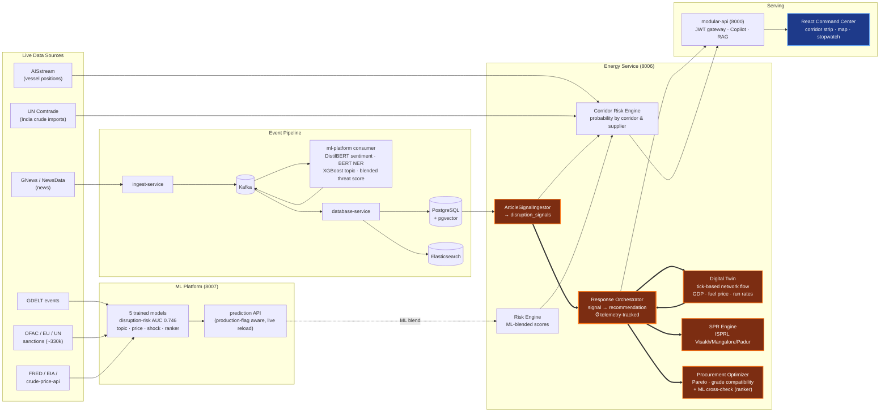

# ProxyDefence Architecture

AI-driven energy supply-chain resilience for import-dependent economies.
The highlighted path is the **golden thread**: a live geopolitical signal
becomes an executable procurement + SPR decision in under 60 seconds, with
every stage timestamped in `energy.response_telemetry`.



## The golden thread (measured)

```
disruption signal (news→ML, live)          t = 0
  → scenario match (keyword→template)      + <1s
  → digital twin run (30-day horizon)      + ~8s
  → SPR optimization (3 ISPRL sites)       + ~2s
  → procurement orchestration (Pareto)     + ~2s
  = executable recommendation              ~12s measured p50
```

Every response writes `energy.response_telemetry`
(signal_detected_at → analysis_started_at → analysis_completed_at →
recommendation_generated_at, total_latency_seconds).
`GET /api/v1/intelligence/command/telemetry` serves p50/p95.

## Corridor disruption probability (the brief's #1 build)

Transparent composite index per corridor (Hormuz, Red Sea/Suez, Cape,
West Africa, Malacca): 0.35·signal pressure + 0.20·entity ML risk +
0.15·GDELT instability + 0.10·AIS anomaly + 0.20·historical anomaly →
logistic squash. Every weight published in an `assumptions[]` block with
a how-to-test recipe; every driver is a named live signal. The historical
anomaly driver is a z-score of today's live signal count against a real
45-day GDELT event-count baseline for the corridor's partner countries —
data-driven, not a trained model, and added specifically because the rare
event this corridor risk is trying to price (a full closure) has no
labeled history to train a classifier on (see `docs/07_ML_PROCESSES.md`
§5). India import share per corridor from UN Comtrade 2021-24
(Hormuz: 46.5% in 2024).

## ML cross-check on procurement

`procurement-option-ranker` (trained XGBoost regressor, val R² 0.246) is
wired into `procurement/optimizer.py` as a second opinion, not a
replacement: the deterministic Pareto/composite score stays primary, and
the ranker's independent prediction is surfaced alongside it as
`ml_predicted_score` with a `score_divergence` flag when the two disagree
by more than 0.15. Visible in the Command Center's Procurement tab as the
"ML Cross-Check" card. Full model inventory and what's genuinely trained
vs. deterministic-by-design: `docs/07_ML_PROCESSES.md`.
```
